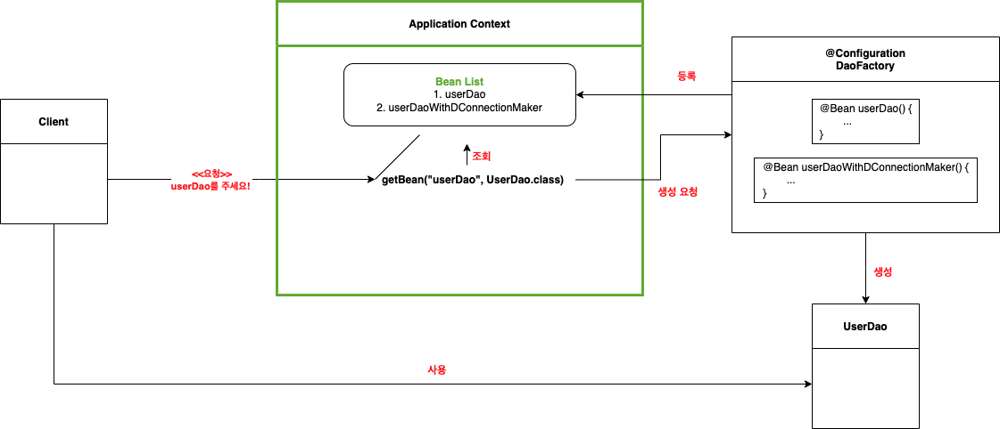
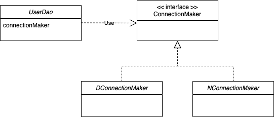

# 1장: 오브젝트와 의존관계

스프링의 핵심 철학은 ‘객체지향 기술의 가치'의 본질적인 면모를 다시 누릴 수 있게 기본으로 돌아가자는 것입니다. 따라서 가장 관심을 두는 대상 역시 ‘객체'(저자는 오브젝트라고 표현)입니다. 서적은 주로 스프링이 객체지향의 본질을 어떻게 이해하고 활용하는지에 대해 기술되어 있고, 이 과정 속에서 객체지향의 특징과 사용 방법, 디자인 패턴, 리팩토링 과정 등을 저자와 같이 확인해보겠습니다. 

서적을 읽고 제가 중요하다고 느꼈던 객체지향의 개념들을 중요한 부분을 정리한 글입니다. 목차의 세부 요소로 학습해야 하는 키워드들을 정리했습니다. 이번 장에서는 앞서 말한 것들 중 스프링이 객체지향의 기술을 어떻게 활용하는지를 집중해서 확인해보겠습니다. 확인해볼 내용은 아래와 같습니다.

### INDEX

1. **초난감 DAO**
2. **DAO의 분리**
    - 관심사란?
    - 상속을 통한 기능 확장, 템플릿 메서드 패턴
3. **DAO의 확장**
    - 인터페이스와 클라이언트를 통한 OCP 원칙 준수
    - 전략 패턴
4. **제어의 역전(IoC)**
    - 

---

## 1. 초난감 DAO

- 첫 번째 예제에는 사용자 정보를 JDBC API를 활용해 데이터베이스에 저장하고 조회하는 간단한 DAO 객체가 필요하다. 이를 위해 필요한 User 객체도 같이 생성하자.
    - 예제와 테스트를 위해 필요한 데이터베이스는 H2를, Getter, Setter의 편리한 생성을 위해 Lombok을 사용해보겠다. 의존성과 어노테이션을 위해 빌드 툴 gradle도 같이 사용하자. 아래는 User 객체와 조회, 생성 기능을 담당하는 UserDao 객체다.
        
        ```java
        package part1;
        
        import java.sql.*;
        
        public class UserDao {
        
            public void add(User user) throws ClassNotFoundException, SQLException {
                Class.forName ("org.h2.Driver");
                Connection conn = DriverManager.getConnection ("jdbc:h2:tcp://localhost/~/test", "sa","");
        
                PreparedStatement ps = conn.prepareStatement("insert into users(id, name, password) values (?,?,?)");
                ps.setString(1, user.getId());
                ps.setString(2, user.getName());
                ps.setString(3, user.getPassword());
        
                ps.executeUpdate();
        
                ps.close();
                conn.close();
            }
        
            public User get(String id) throws ClassNotFoundException, SQLException {
                Class.forName ("org.h2.Driver");
                Connection conn = DriverManager.getConnection ("jdbc:h2:tcp://localhost/~/test", "sa","");
        
                PreparedStatement ps = conn.prepareStatement("select * from users where id = ?");
                ps.setString(1,id);
        
                ResultSet resultSet = ps.executeQuery();
                resultSet.next();
        
                User user = new User();
                user.setId(resultSet.getString("id"));
                user.setName(resultSet.getString("name"));
                user.setPassword(resultSet.getString("password"));
        
                resultSet.close();
                ps.close();
                conn.close();
        
                return user;
            }
        
            public static void main(String[] args) throws SQLException, ClassNotFoundException {
                UserDao userDao = new UserDao();
        
                User user = new User();
                user.setId("leeho");
                user.setName("이호");
                user.setPassword("25");
        
                userDao.add(user);
        
                System.out.println(user.getId() + "등록에 성공했습니다!"); // leeho 등록에 성공했습니다!
        
                User userLeeho = userDao.get(user.getId());
                System.out.println("userLeeho.name = " + userLeeho.getName()); /// userLeeho.name = 이호
                System.out.println("userLeeho.password = " + userLeeho.getPassword()); // userLeeho.password = 25
            }
        }
        ```
        
    - UserDao는 데이터베이스에 사용자를 등록하고 조회하는 기능을 수행하는 아주아주 간단한 객체다. 그리고 main() 메서드를 통해 테스트까지 가능하며, 정상적으로 작동한다. 하지만 서적에서는 이 코드를 ‘초난감'하다고 표현했다. 그 이유는 뭘까?
    - 이제 위 코드가 정상적으로 동작하고 있음에도 초난감한 이유를 확인해보자.
    - 이 과정에서 코드를 객체지향스럽게 변경해보며 어떤 이점을 가져다 주는지를 살펴보고, 또한 객체지향스럽게 변경하는 과정을 스프링은 어떤 방식으로 제공하는지도 같이 확인해보자.

---

## 2. DAO의 분리

- **관심사란?**
    
    > ***우주에서 변하지 않는 유일한 것은 모든 것은 ‘변한다’는 사실 뿐이다.***
    > 
    - 그리스의 철학자 헤라클레이토스는 이런 말을 했다. 소프트웨어도 마찬가지다. 설계, 요구사항, 구현한 코드 등 모든 것이 변하며 서비스가 종료되지 않는 이상 모든 소프트웨어는 끊임없이 변화한다. 따라서 우리는 소프트웨어의 코드를 항상 변화에 유연하게 작성해야 할 필요가 있다. 그래야 끊임없이 변하는 세상에 물흐르듯 대응할 수 있다. 그렇다면 우리는 이 끊임없는 변화를 어떻게 대처해야 할까?
    - 답은 **“객체지향"** 이다. 사실 패러다임이란 프로그램이 구현해야하는 기능을 분해하고 구현하는 방식을 나타내는 것이다. 그리고 여러 패러다임 중 객체지향 패러다임은 변화에 유연하게 대응할 수 있도록 설계를 구성할 수 있는 장점이 있다. 사실 이 변화들에는 한 가지 패턴이 존재하는데, 대부분 한 번에 한 가지 관심에 집중해서 일어난다는 것이다. 따라서 우리가 변화에 잘 대응하기 위해 해야할 일은 관심 있는 것들이 모여있게 하는 것인데, 이것이 바로 프로그래밍의 기초 개념 중 하나인 **관심사의 분리, Separation of Concerns** 이다.

- **그렇다면 앞서 만든 초난감한 녀석 UserDao의 관심사는 무엇일까? 우리는 총 세 가지의 관심사를 발견할 수 있다.**
    1. *H2 데이터베이스와 어떻게 연결할 것인가?*
    2. *DB에 보낼 SQL을 어떻게 만들고 실행할 것인가?*
    3. *1번 과정에서 DB에 연결할 때 사용한 공유 리소스들은 어떻게 반납할 것인가?*
    
    - 이 중 1번, 3번에 대한 관심사는 UserDao의 add(), get()에서 중복되어 있다. 만약 같은 패턴의 메서드가 추가된다면? 또 다른 중복이 추가된다.
        - 우리는 이를 통해 하나의 관심사(코드)가 여러 곳에 중복되어 있다고 판단할 수 있다.
    - 위에서 변화에 잘 대응하는 방법은 **관심 있는 것들을 모여있게 하는 것**이라고 했다. 한번 모여있게 변경해보자.
    - 가장 먼저 해야할 일은 1번 관심사인 H2 데이터베이스와의 연결을 위해 필요한 Connection 객체를 생성하는 부분을 하나로 모아주는 것이다.
    - 아래는 getConnection() 메서드를 통해 DB 커넥션을 가져오는 부분을 모아둔 코드다. 아래와 같이 변경하게 되면, 우리는 DB 연결과 관련된 변경이 있었을 때 add(), get()을 일일히 변경하지 않고 getConnection()만 변경해 변화에 대응이 가능하다
        
        ```java
        public User add(User user) throws ClassNotFoundException, SQLException {
            Connection conn = getConnection();
        		...
        }
        
        public User get(String id) throws ClassNotFoundException, SQLException {
            Connection conn = getConnection();
        		...
        }
        
        private Connection getConnection() throws ClassNotFoundException, SQLException {
            Class.forName ("org.h2.Driver");
            Connection conn = DriverManager.getConnection ("jdbc:h2:tcp://localhost/~/test", "sa","");
            return conn;
        }
        ```
        
    - 즉 관심 내용이 독립적인 상태를 유지하게 되어, 하나의 관심사의 변화가 다른 관심사를 위해 존재하는 코드에 영향을 미치지 않는다.
    - 관심사의 분리는 이렇듯 **자신의 변경 사항이 다른 코드에 영향을 주지 않도록 변경 영역을 최소화**하는 장점을 이끌어 낼 수 있다.
    
- **상속을 통한 확장, 템플릿 메서드 패턴(Template method pattern)**
    - 아래 코드는 데이터베이스 연결에 변화에 유연하게 대처하기 위해 수정된 코드다. 우선 본문에서의 예시를 그대로 차용해보자.
        - UserDao가 인기가 많아져 다른 회사에서 이 UserDao를 구매하겠다는 요청이 왔다. 우리는 소스코드를 직접 제공하는 방법 외에 클래스 바이너리 파일만 제공해 각 회사가 각자의 데이터베이스에 알맞게 사용할 수 있도록 하려면 어떻게 해야할까?
    - 이 때 우리가 사용할 수 있는 첫 번째 방법은 **상속을 통한 확장**이다. UserDao를 추상 클래스로 만들어 각 회사가 직접 구현해 사용하도록 해보자.
        
        ```java
        public void add(User user) throws ClassNotFoundException, SQLException {
            Connection conn = getConnection();
        		...
        }
        
        public User get(String id) throws ClassNotFoundException, SQLException {
            Connection conn = getConnection();
        		...
        }
        
        // 추상 메서드로 선언, 각 회사에서 직접 구현해 사용하도록 처리
        public abstract Connection getConnection() throws ClassNotFoundException, SQLException;
        
        public class NUserDao extends UserDao{
            @Override
            public Connection getConnection() throws ClassNotFoundException, SQLException {
        				// N사만의 독자적인 커넥션 생성하여 반환하는 코드 구현
            }
        }
        
        public class DUserDao extends UserDao{
            @Override
            public Connection getConnection() throws ClassNotFoundException, SQLException {
        				// D사만의 독자적인 커넥션 생성하여 반환하는 코드 구현
            }
        }
        ```
        
    - 이렇게 슈퍼 클래스(UserDao)에 변하지 않는(굉장히 중요) 기본적인 로직 흐름을 만들고, 상황에 따라 변경이 필요한 기능의 일부(getConnection)를 추상 메서드나 오버라이딩이 가능한 protected 메서드로 만들어 서브 클래스(NUserDao, DUserDao)에서 필요에 맞게 구현해서 사용하도록 하는 방법을 **템플릿 메서드 패턴(Template method pattern)**이라고 한다.
    
- 이 경우 실제 Connection 객체를 생성하는 책임은 서브 클래스에 존재한다.
    - 추상 메서드는 실제 구현을 하지 않으며, 이를 상속한 서브 클래스가 구현하게 된다.
    - 즉 getConnection() 메서드는 Connection 객체의 생성 방법을 결정한다고도 볼 수 있다.
    - 이렇게 서브 클래스에서 구체적인 객체의 생성 방법을 결정하게 하는 것을 **팩토리 메서드 패턴(Factory method pattern)** 이라 부르기도 합니다.
    - 여기서도 앞서 확인한 관심사가 적절히 분리된 것을 확인할 수 있다.
        - UserDao는 add(), get() 등의 메서드로 커넥션을 사용하고 SQL을 작성해 실행하는 것에만 관심이 있고
        - DUserDao와 NUserDao는 어떻게 커넥션을 생성할지만 관심을 갖는다.
- 하지만 사실 상속에는 여러 단점이 존재한다.
    - 클래스의 다중 상속을 지원하지 않기 때문에 상속의 경로가 제한된다.
        - *만약 커넥션 연결이 아닌 다른 관심사도 같이 상속하고 싶다면, 커넥션 연결까지 합쳐 상속시켜야 한다.*
        - 서브클래스는 슈퍼클래스의 메서드를 직접 사용할 수 있기에 둘 사이에는 많은 결합도가 존재한다
        - *만약 UserDao를 구매하는 회사가 늘어난다면 UserDao를 상속하는 서브 클래스는 그 수만큼 끝없이 늘어난다.*

---

### 3. DAO의 확장

- 상속을 통해 확장을 하는 방식의 문제점은 명확했다. 다중 상속 불가에 따른 목적성 제한, 높은 결합도, 서브클래스의 무한한 중복을 우린 어떻게 해결해야 할까?
    - 다중 상속이 안된다면 꼭 상속이 필요한 지부터 되물어보자.
    - UserDao에서 add(),get()와 getConnection()s는 다른 관심사를 갖고 있다는 것을 우린 앞서 확인했다.
    - 그렇다면 굳이 같은 클래스에 있어야 할까? 둘을 분리시켜보자.

- UserDAO에서 담당하는 커넥션 생성 기능을 아예 분리해 다른 클래스로 옮겼다.
    
    ```java
    public SimpleConnectionMaker {
    		public Connection makeNewConnection() { ... }
    }
    ```
    
    ```java
    public class UserDao {
    		private SimpleConnectionMaker simpleConnectionMaker;
    	
    		public UserDao(){
    			this.simpleConnectionMaker = new simpleConnectionMaker**();**
    		}
    
    		public void add(User user) throws ClassNotFoundException, SQLException {
            Connection conn = simpleConnectionMaker.makeNewConnection();
    				...
    		}
    
    		public User get(String id) throws ClassNotFoundException, SQLException {
            Connection conn = simpleConnectionMaker.makeNewConnection();
    				...
    		}
    	
    		public static void main(String[] args) throws SQLException, ClassNotFoundException { ... } // 정상 작동한다
    }
    
    ```
    
    - 관심사가 분리됐지만 앞서 추상 메서드를 활용한 템플릿 메서드 패턴으로 N사와 D사에서 각자 사정에 맞게 커넥션을 생성하는 것은 불가능해졌다.
    - 물론 이 상태에서도 UserDao의 기능은 여전히 정상적으로 동작한다. 이렇게 리팩토링마다 테스트 코드를 통해 시스템의 정상 동작을 확인해주는 것은 무척 중요하다.
    
- 문제점으로 돌아와보자. 우리가 의도한 것은 데이터베이스의 연결과 관련된 관심사는 SimpleConnectionMaker가 모두 가지고 떠나버리는 것이었다.
    - 이를 위해 각각의 관심사를 각자가 책임지도록 클래스를 둘로 깔끔하게 분리시켰지만 결국 UserDao는 다시 데이터베이스 연결에 대한 정보를 알게 되었고, 데이터베이스 연결에 영향을 받게 되었다.
    - 예를 들어 Connection을 연결하는 객체가 SimpleConnecitonMaker에서 NCompanyConnectionMaker, DCompanyConnectionMaker가 되버리면 우린 UserDao의 코드를 직접 변경해줘야 한다.
    - 이는 **다른 관심사의 변경에 영향을 받는다는 것**을 의미한다. 그렇다면 이 문제를 어떻게 해결해줘야 할까? 높은 결합도는 어떤 방법으로 벗어나야 할까?
    
- 해결 방법이 하나 있다. 바로 두 개의 클래스가 서로 긴밀하게 연결되지 않도록 추상적인 연결고리를 만들어 주는 것이다. 그리고 자바에서는 이를 위해 딱맞는 도구를 하나 제공한다. 바로 **인터페이스**다.
    - 인터페이스는 어떤 기능을 수행해야하는 지에 대한 기능만 정의해놓고, 실제 동작에 필요한 구현은 전혀 담지 않는다.
    - 쉽게 현실의 예시를 들어보면 우리는 핸들을 움직일 때 자동차 내부에서 어떻게 방향을 전환시키는지 전혀 모른다. 다만 투싼이든 소나타든 핸들을 꺾으면 자동차가 그 방향으로 움직인다는 사실을 알 뿐이다. 내부적으로 두 자동차가 동작하는 방식은 다를테지만 우리는 핸들이라는 인터페이스를 통해 자동차를 좌우로 움직일 수 있다. 이것이 인터페이스다.
    - 그렇다면 실제 데이터베이스를 어떻게 연결할지는 모르지만 ‘데이터베이스 연결'이라는 기능을 수행하기 위해 필요한 인터페이스를 만들어보자. 인터페이스의 이름은 ConnectionMaker라 하자.
        
        ```java
        public interface ConnectionMaker {
        		public Connection makeConnection() throws SQLException;
        }
        ```
        
    - 아까 UserDao를 추상 클래스로 만들고 각 회사에서 데이터베이스 연결 코드를 각자의 사정에 맞게 구현하도록 한 것처럼 이번엔 UserDao와 ConnectionMaker 인터페이스를 같이 전달해서 구현하도록 하자.
        
        ```java
        public class DConnectionMaker implements ConnectionMaker {
        		@Override
        		public Conneciton makeConnectionO(){
        			// N사만의 독자적인 커넥션 생성하여 반환하는 코드 구현
        		}
        }
        
        public class NConnectionMaker implements ConnectionMaker {
        		public Conneciton makeConnectionO(){
        			// D사만의 독자적인 커넥션 생성하여 반환하는 코드 구현
        		}
        }
        ```
        
        ```java
        public class UserDao {
        	private ConnectionMaker connectionMaker;
        	
        	public UserDao() {
        		this.connectionMaker = new DConnectionMaker();
        	}
        	
        	public void add() { ... }
        	public User get() { ... }
        }
        ```
        

- UserDao가 DB 커넥션을 만드는 기능을 ConnectionMaker 인터페이스에 의존하도록 만들었다. 이제 ConnecitonMaker 타입의 클래스만 있다면 UserDao는 변경되지 않아도 된다. 라고 생각했지만 여기도 문제가 있다 ☹️
    - UserDao 생성자에 ConnectionMaker를 어떤 구현체로 사용할 것인지를 결정하는 코드가 남아있다.
    - 결국 위 코드대로라면 UserDao에 new NConnectionMaker(), new DConnectionMaker()를 통해 직접 데이터베이스 연결 방법에 대한 구현 클래스를 넣어줘야 한다.
    - 결국 우린 UserDao와 UserDao가 사용할 ConnectionMaker의 특정 구현 클래스 사이의 관계를 설정해주는 관심사를 담은 코드를 분리하지 않으면 UserDao는 결코 독립적으로 확장가능한 클래스가 될 수 없다.
    - 그런데 잘 생각해보자. 어떤 데이터베이스 연결에 대해 관심이 있는건 과연 누구인가? 바로 N사, D사다. 우리의 클라이언트다. 여기서 클라이언트라고 지칭한 것은 중의적인 의미가 있다. UserDao를 구매한 클라이언트이기도 하지만, UserDao 오브젝트를 사용하는 오브젝트 상의 클라이언트이기도 하다. 즉 어떤 구현체를 사용할 것인지에 대한 책임은 결국 UserDao를 사용하는 클라이언트한테 있다.
    - 즉 관심사가 하나 남아있었다. 바로 관계 설정에 대한 관심사다. 이것을 UserDao의 클라이언트에게 떠넘기면 문제가 해결된다.

- UserDao와 ConncetionMaker 사이에서는 UserDao의 인스턴스 필드 connectionMaker 외에는 절대 ConnectionMaker 구현체에 대한 의존성이 존재해서는 안된다.
    - UserDao가 생성자에서 ConnectionMaker를 생성하던 책임을 클라이언트로 위임**했다.**
        
        ```java
        public class UserDao {
        	private ConnectionMaker connectionMaker;
        	
        	public UserDao(ConnectionMaker connectionMaker) {
        		this.connectionMaker = connectionMaker;
        	}
        	...
        }
        ```
        
    - 그리고 실제로도 UserDao와 ConnectionMaker 사이의 관계를 설정하기에 적임자는 UserDao를 사용하는 클라이언트가 맞다. 클라이언트의 이름은 UserDaoTest로 하겠다.
        
        ```java
        public class UserDaoTest {
            public static void main(String[] args) throws SQLException, ClassNotFoundException {
        				
        		    // UserDaoTest의 책임은 UserDao와 ConnectionMaker 사이의 런타임 의존성을 설정해주는 것
                ConnectionMaker connectionMaker = new DConnectionMaker();
                UserDao userDao = new UserDao(connectionMaker);
        
                User user = new User();
                user.setId("leeho");
                user.setName("이호");
                user.setPassword("25");
        
                userDao.add(user);
        
                System.out.println(user.getId() + "등록에 성공했습니다!");
        
                User userLeeho = userDao.get(user.getId());
                System.out.println("userLeeho.name = " + userLeeho.getName());
                System.out.println("userLeeho.password = " + userLeeho.getPassword());
            }
        
        ```
        
    - 기존 UserDao의 생성자에서 직접 DConnectionMaker 객체를 주입하던 부분을 클라이언트인 UserDaoTest로 옮겼다.
        - 따라서 UserDao는 컴파일 타임에는 ConnectionMaker에 의존하고 런타임 타임에는 클라이언트에 의해 DConnectionMaker 혹은 NConnectionMaker에 다이내믹하게 의존한다.
    
- 이제 UserDao는 자신의 관심사와 책임에만 집중할 수 있도록 변경되었다. 사용자 데이터 액세스 작업을 위한 SQL을 생성하고 실행하는 것에만 집중하며, DB 생성, 커넥션을 가져오는 방법의 변경은 UserDao에게 영향을 끼치지 않는다.
    - 이렇듯 상속을 사용하는 법보다 인터페이스를 도입하고 클라이언트의 도움을 얻는 방법이 훨씬 유연하고 깔끔한 방법이다.
    - 지금까지 작업했던 것들은 결국 시스템의 기능에 대한 관심사를 적절한 객체들에게 분배하는 것이었다. 이를 통해 변경사항이 생겼을 때 관심이 있는 객체들만 변함으로써 다른 객체에게 변경에 대한 영향을 최소화하려는 목적을 이룰 수 있었다.
    - 그렇다면 이런 내용들을 조금은 어려울 수도 있는 단어들로 확인해보자.

- **개방 폐쇄 원칙, Open-Closed Principle**
    - 우리가 만약 **DB 연결 방법이라는 기능을 확장**하고 싶을 때 ConnectionMaker 인터페이스를 구현하는 새로운 클래스만 생성하면 끝나도록 작업했다.
    - 이 경우 핵심 기능을 구현한 add(), get()에는 전혀 영향을 받지 않으며 결국 변경에 일어날 수 있는 지점들은 인터페이스를 통해 변경에 유연하도록 변경하면 된다.
    - 이 원칙은 높은 응집도와 낮은 결합도라는 소프트웨어의 고전 원리로도 설명할 수 있다.
        - 우선 **높은 응집도**다. 이는 변경이 일어날 때 모듈 내부에서 얼마나 많은 지점들이 변경되는가?에 대한 내용이다.
        - 많은 곳이 변경될 수록 응집도가 높다. 따라서 하나의 책임, 관심사에 집중되어 있다는 것을 증명해주는 특성이다.
    - 다음은 **낮은 결합도**이다. 다른 객체와 관계를 유지할 때 최소한의 방법으로 유지하는 상태를 의미한다. 결합도는
        - 내가 변경될 때 관계를 맺는 다른 객체에게 얼마나 변경을 요구하는가에 대한 특성으로 결합도는 궁극적으로 변경의 전파를 의미한다.

- **전략 패턴**
    - 우리가 UserDao에서 시작해 UserDao 내부에 Connection 관련 메서드를 만드는 과정, 그리고 이를 SimpleConnectionMaker → ConnectionMaker 인터페이스까지 진행했던 과정은 결국은 시스템의 기능을 어떻게 분해하고 나눌지 디자인한 과정들이었다.
    - 그리고 이런 문제들은 오랫동안 중복되서 나타나 왔고, 우리는 이러한 방법들을 아카이빙해 ‘디자인 패턴'이라는 이름으로 불렀다.
    - 우리는 최종적으로 UserDaoTest-UserDao-ConnectionMaker 구조를 만들었는데, 이것이 디자인 패턴 중 하나인 **전략 패턴**이다.
        - 전략 패턴은 먼저 자신의 기능 맥락(UserDao)에서 필요에 따라 변경되야 하는 알고리즘(ConnectionMaker)을 인터페이스를 통해 통째로 분리시킨다.
        - 그리고 이를 구현한 알고리즘 클래스(NConnectionMaker, DConnecitonMaker)를 필요에 따라 클라이언트(UserDaoTest)가 바꿔서 사용할 수 있게 하는 디자인 패턴이다.
        - 전략 패턴에서 클라이언트의 역할은 컨텍스트가 사용할 전략을 컨텍스트의 생성자를 통해 제공하는게 일반적이다.
    - 궁극적으로 현재 구조를 살펴보면 전략 패턴을 사용해 낮은 결합도와 높은 응집도를 유지하고 있는 것을 확인할 수 있다.

---

## 4. 제어의 역전 (IoC)

- 우리는 아까 전략 패턴을 적용하며 UserDao와 ConnectionMaker의 관계 설정에 대한 책임을 UserDaoTest에게 넘겨버렸다. 그리고 UserDaoTest는 클라이언트의 역할을 담당하게 됐다.
    - 근데 사실 UserDaoTest는 이름부터 테스트를 위한 객체다.
    - 즉 관계 설정의 책임 역시 UserDaoTest의 본래의 책임이 아니다. 다시 관심사를 분리할 차례다.
    - 이번에는 UserDao, ConnectionMaker를 만드는 기능과 둘의 관계 설정에 대해 책임이 있는 새로운 객체를 만들어보자.

- 우리가 만들고자 하는 클래스는 UserDao, ConnectionMaker의 구현체같은 객체의 생성 방법을 결정하고 만든 뒤 돌려주는 객체다. 이를 우리는 **‘팩토리 factory’** 라고 부른다.
    - 객체의 생성 방법을 결정하고 만들어진 오브젝트를 돌려주는 역할로 오브젝트를 생성하는 쪽과 사용하는 쪽의 역할과 책임을 분리하려는 목적이다.
    - 추상 팩토리 패턴, 팩토리 메서드 패턴과는 다르니 혼동하지 말자.
    - 팩토리 클래스인 DaoFactory를 새로 생성해 오브젝트를 만드는 책임을 위임하자.
        
        ```java
        public class DaoFactory {
        	public UserDao userDao(){
        		// 팩토리 메서드의 역할은 오브젝트를 어떻게 만들고, 어떻게 준비시킬지를 결정하는 것
        		ConnecitonMaker connectionMaker = new DConnecitonMaker();
        		UserDao userDao = new UserDao(connectionMaker);
        		return userDao;
        	}
        }
        
        public class UserDaoTest {
        	public static void main(String[] args) {
        		// UserDao와 ConnectionMaker 구현체를 생성하고 관계를 설정해주는 DaoFactory를 통해 UserDao 생성
        		User dao = new DaoFactory().userDao()
        		
        		// 테스트 코드 작성
        		...
        	}
        }
        ```
        
    
- 자 여기서 지금까지 만들어진 객체들을 한번 정리해보자.
    - USerDao, ConnectionMaker는 핵심 기능(데이터베이스에 쿼리를 작성하고 실행, 데이터베이스 연결)을 담당한다.
    - 반면 DaoFactory는 이런 객체들을 구성하고 서로의 관계를 맺어주는 책임을 갖는다.
    - 즉 UserDao, ConnectionMaker는 실질적인 로직을 담당하는 컴포넌트, DaoFactory는 컴포넌트의 구조와 관계를 정의해놓은 설계도의 역할을 한다고 볼 수 있다.

- 그런데 DaoFactory가 UserDao 말고도 다른 Dao를 생성하게 된다면?
    - 어떤 ConnectionMaker의 구현 클래스를 사용하는 지를 결정하는 기능이 중복된다.
        
        ```java
        public class DaoFactory {
        
        	public UserDao userDao(){ 
        		return new UserDao(new DConnectionMaker()); // new DConnectionMaker() 중복!
        	}
        
        	public AccountDao accountDao(){ 
        		return new AccountDao(new DConnectionMaker()); // new DConnectionMaker() 중복!
        	}
        	
        	public MessageDao messageDao(){ 
        		return new MessageDao(new DConnectionMaker()); // new DConnectionMaker() 중복!
        	}
        }
        ```
        
    - 분리가 답이다.
        
        ```java
        public class DaoFactory {
        
        	public UserDao userDao(){ 
        		return new UserDao(connectionMaker()); 
        	}
        
        	public AccountDao accountDao(){ 
        		return new AccountDao(connectionMaker()); 
        	}
        	
        	public MessageDao messageDao(){ 
        		return new MessageDao(connectionMaker()); 
        	}
        
        	public ConnectionMaker connectionMaker(){
        		return new DConnectionMaker(); // 중복 제거
        	}
        }
        ```
        

- 그렇다면 여기서 이번 파트의 제목인 제어권의 역전에 대해서 잠시만 알아보자.
    - 우선 일반적인 프로그램의 흐름은 main() 메서드같은 프로그램이 시작 지점에서 사용할 오브젝트를 결정하고 생성하며 생성된 오브젝트의 메서드를 호출하는 식의 작업이 반복된다.
        - 즉 UserDaoTest처럼 모든 종류의 작업을 사용하는 쪽에서 제어한다.
    - 하지만 제어의 역전은 이런 작업을 주관하는 주체를 **사용하는 쪽이 아닌 다른 쪽으로 뒤집는 것**이다.
        - 오브젝트들은 원래 자신이 사용할 오브젝트를 생성하고 사용했지만 제어의 역전에서는 자신이 어떻게 만들어지는지, 어디서 사용되는지 전혀 모른다.
        - 제어 권한을 사용하는 쪽이 아닌 다른 대상에게 위임하기 때문에 위 같은 현상이 일어난다.
    - 서블릿 역시 제어의 역전 개념이 적용된 사례다.
        - main() 메서드를 통해 직접 실행되지 않으며, 서블릿의 제어 권한을 가진 서블릿 컨테이너가 적절한 시점에 오브젝트를 생성하고 오브젝트의 메서드를 호출한다.
    - 프레임워크도 제어의 역전 개념이 적용된 대표적인 기술이다.
        - 라이브러리를 사용한 애플리케이션 코드는 애플리케이션 흐름을 직접 제어하지만, 하지만 프레임워크는 프레임워크에 의해 애플리케이션 코드가 사용된다. 프레임워크는 분명한 제어의 역전 개념이 적용되어 있어야 한다.
        - *ex.* Spring에서 Controller, Service, Repository 레이어에 작성한 메서드들은 스프링 내부 동작에 의해 실행된다.
    - 제어의 역전은 설계를 깔끔하게 만들며, 유연성을 증가시키며 확장성도 좋아지게 만든다.이 때 애플리케이션 컴포넌트의 생성과 관계설정, 사용, 생명주기 관리 등을 관장하는 존재가 필요한데 그것이 바로 IoC 컨테이너이다.

---

### 5. 스프링의 IoC

- 스프링에서는 스프링이 제어권을 가지고 직접 만들고 관계를 부여하는 오브젝트를 **빈 bean**이라고 부른다.
    - 빈의 생성과 관계설정 같은 제어를 담당하는 IoC 오브젝트를 **Bean Factory**라고 부른다.
    - 스프링에서는 일반적인 빈 팩토리보단 좀더 확장한 개념인 애플리케이션 컨텍스트 application context를 주로 사용한다.
        - 애플리케이션 컨텍스트: 애플리케이션 전반에 걸쳐 모든 구성요소의 제어 작업을 담당하는 IoC 엔진
        - 이 때 애플리케이션 컨텍스트는 DaoFactory처럼 설정 정보를 모두 갖고 있진 않다. 설정정보를 담고 있는 무언가를 가져와 활용하는 엔진이라는 점이 다르다.
        
- 스프링이 DaoFactory을 설정정보로 사용하도록 만들어보자.
    - 스프링이 DaoFactory가 **빈 팩토리를 위한 오브젝트 설정을 담당하는 클래스**를 라고 인식할 수 있도록 `@Configuration` 애노테이션을 추가하자.
    - DaoFactory에서 **오브젝트 생성을 담당하는 userDao를 IoC용 메서드로 인식**할 수 있도록 `@Bean` 애노테이션을 달아주자
        
        ```java
        @Configuration
        public class DaoFactory {
        	
        	// 생성될 빈의 이름은 메서드 이름과 동일
        	@Bean
        	public UserDao userDao() { 
        		return new UserDao(connecitonMaker());
        	}
        
        	@Bean
        	public ConnecitonMaker connecitonMaker(){
        		return new DConnectionMaker();
        	}
        }
        ```
        
    - DaoFactory를 설정정보로 사용하는 애플리케이션 컨텍스트를 만들어보자.
        
        ```java
        public class UserDaoTest {
        	public static void main(String[] args) {
        		ApplicationContext context = new AnnotationConfigApplicationContext(DaoFactory.class);
        		UserDao dao = context.getBean("userDao", UserDao.class);
        		... 
        	}
        }
        ```
        
    - getBean()은 애플리케이션 컨텍스트가 생성하고 관리하는 오브젝트를 요청하는 메서드이며, 파라미터로 넣은 userDao는 @Bean을 붙힌 메서드 이름이다.
    - 이 때 메서드 이름을 파라미터로 사용하는 이유는 userDao를 생성하는 방식, 구성을 다르게 가질수도 있기 때문이다.
    - 만약 DConnectionMaker()가 아닌 NConnectionMaker()가 들어간 userDao가 필요하다면 DaoFactory에 userDaoWithDConnectionMaker() 를 생성한 뒤 @Bean을 매핑해서 가져오면 된다.
        
        ```java
        @Configuration
        public class DaoFactory {
        	@Bean
        	public UserDao userDaoWithDConnectionMaker() {
        		return new UserDao(new NConnectionMaker());
        	}
        	...
        }
        ```
        
    - getBean()은 기본적으로 Object로 리턴하는데, 매번 리턴할 때마다 오브젝트를 다시 캐스팅해줘야 하는 부담이 있다.
        - 스프링은 이를 자바 5 이상에서 지원하는 제네릭 메서드 방식을 사용해 getBean()의 두번째 파라미터에 리턴 타입을 줘, 지저분한 캐스팅 코드를 제거하도록 했다.
        
        > ***Return an instance, which may be shared or independent, of the specified bean.**
        (공유되거나 독립적일 가능성이 있는) 특정 빈 인스턴스를 반환합니다.
        
        **Behaves the same as getBean(String), but provides a measure of type safety by throwing a BeanNotOfRequiredTypeException if the bean is not of the required type. This means that ClassCastException can't be thrown on casting the result correctly, as can happen with getBean(String).**
        getBean(String param)과 동일하게 동작하지만, 만약 빈이 인자로 명시된 특정 타입이 아닌 경우 BeanNotOfRequiredTypeException을 발생시킵니다. 
        이는 getBean()처럼 변환하고자 하는 타입이 올바르지 않을 때 발생하는 ClassCastException을 발생시키지 않는다는 것을 의미합니다.*
        
        …
        > 

- 위에서 설명한 오브젝트 팩토리(DaoFactory)에 대응되는 것이 스프링의 애플리케이션 컨텍스트다. 그렇다면 스프링은 우리가 작성한 DaoFactory와는 어떻게 다를까?
    - DaoFactory는 UserDao를 비롯한 DAO 오브젝트를 생성하고 DB 생성 오브젝트와 관계를 맺어주는 제한적인 역할이었다.
    - 반면 애플리케이션 컨텍스트는 애플리케이션에서 IoC를 적용해 관리해야할 모든 오브젝트에 대한 생성과 관계설정을 담당한다.
    - 다만 애플리케이션 컨텍스트에는 오브젝트 팩토리(DaoFactory)처럼 직접 객체를 생성하는 정보가 있지 않고, 이런 작업을 위해 필요한 정보를 별도의 설정정보를 통해 얻는다.
    - 아래는 애플리케이션 컨텍스트의 동작방식이다.
        
        <p align="center"></p>
        
        1. 애플리케이션 컨텍스트는 DaoFactory 클래스를 설정정보로 등록해두고, @Bean 메소드의 이름을 가져와 빈 목록을 만들어둔다. 
            - 아직까지는 생성하지 않은 상태다. 첫 호출 전에는 호출하면 생성할 수 있도록 레시피만 가지고 있는 상태다.
        2. 클라이언트가 애플리케이션 컨텍스트의 getBean() 메서드를 호출하면 1번에서 만들어 놓은 빈 목록(레시피)에서 요청한 이름이 있는지 찾는다.
        3. 있다면 빈을 생성하는 메서드를 호출해 오브젝트를 생성해 클라이언트에게 돌려준다. 
            - 이 때 애플리케이션 컨텍스트에서는 관리하는 오브젝트들의 호출에 대해 항상 같은 객체를 반환한다.
            - 이는 애플리케이션 컨텍스트가 **싱클톤 레지스트리**라는 의미다. 스프링이 적용되는 대상이 주로 자바 엔터프라이즈 기술을 사용하는 서버 환경이기 때문에 그렇다.
            
- 우리는 DaoFactory를 사용할 때보다 스프링의 애플리케이션 컨텍스트를 사용함으로써 총 3가지의 장점을 가질 수 있다.
    1. *클라이언트는 구체적인 팩토리 클래스를 알 필요가 없다.*
        
        → IoC 적용이 필요한 객체가 아무리 많아져도 팩토리 클래스를 직접 선택하지 않고 애플리케이션 컨텍스트만 사용하면 되며, 가져오는 방식도 통일된다.
        
    2. *애플리케이션 컨텍스트는 종합 IoC 서비스를 제공해준다.*
        
        → 객체의 생성 방식과 시점 등의 전략을 다르게 가져갈 수 있으며 자동생성, 후처리, 정보의 조합, 설정 방식의 다변화, 인터셉팅 등 효과적인 기능을 제공한다.
        
    3. *애플리케이션 컨텍스트는 빈을 검색하는 다양한 방법을 제공한다.*

---

### 6. 싱글톤 레지스트리와 오브젝트 스코프

- DaoFactory와 애플리케이션 컨텍스트는 UserDao 오브젝트를 돌려주는 역할에서는 동일하다고 느껴진다. 하지만 이 둘은 많은 차이점이 있다.
    - DaoFactory는 userDao() 메서드를 통해 userDao 객체를 반환받을 때마다 새로 생성된, 즉 동일한 오브젝트를 반환받지 못한다.
        
        ```java
        @Test
        public void test_daoFactory_return_diff_obj(){
            // given
            DaoFactory daoFactory = new DaoFactory();
            List<UserDao> daos = new ArrayList<>();
        
            // when
            daos.add(daoFactory.userDao());
            daos.add(daoFactory.userDao());
        
            // then
            System.out.println(daos.get(0)); // UserDao@709ba3fb
            System.out.println(daos.get(1)); // UserDao@3d36e4cd
            assertThat(daos.get(0)).isNotEqualTo(daos.get(1));
        }
        ```
        
    - 하지만 애플리케이션 컨텍스트는 동일한 오브젝트가 나온다. 스프링은 기본적으로 내부에서 생성하는 빈 오브젝트를 모두 싱글톤으로 만들어 반환한다.
        
        ```java
        @Test
        public void test_applicationContext_return_equal_same_obj(){
            // given
            ApplicationContext applicationContext = new AnnotationConfigApplicationContext(DaoFactory.class);
        
            // when
            UserDao userDao = applicationContext.getBean("userDao", UserDao.class);
            UserDao userDao2 = applicationContext.getBean("userDao", UserDao.class);
        
            // then
            System.out.println(userDao);  // UserDao@7674b62c
            System.out.println(userDao2); // UserDao@7674b62c
            assertThat(userDao).isEqualTo(userDao2);
        }
        ```
        
- 싱글톤으로 만드는 이유는 스프링이 주로 서버 환경을 목적으로 만들어졌기 때문이다. 1초에 수만개의 요청이 몰릴 수 있기에 이 때마다 객체를 생성하는 건 말도 안된다.
    - 따라서 엔터프라이즈 분야엥서는 ‘서비스 오브젝트'라는 개념을 일찍부터 사용해왔다.
    - 그리고 서비스 오브젝트는 싱글톤으로 만들어 멀티 스레드 환경에서 동작한다.
    - 하지만 일반적인 싱글톤 패턴은 다음과 같은 한계를 갖는다.
        1. private 생성자로 인한 상속 불가, static field & method의 사용으로 인해 객체지향의 장점의 적용이 어렵다.
        2. 생성 방식이 제한적이기 때문에 테스트하기가 어렵다.
        3. 서버 환경에서는 싱글톤이 하나만 만들어지는 것을 보장하지 못한다. 
            - 여러 개의 JVM에 분산되어 설치되는 경우 클래스 로더의 구성에 따라 클래스가 하나임에도 하나 이상의 오브젝트가 만들어질 수 있다.
        4. 싱글톤은 누구나 사용할 수 있다. 클라이언트가 지정되있지 않다는 의미다. 
            - 따라서 전역 상태로 사용되기 쉽고, 이는 접근,수정,공유가 자유롭다는 의미다. 이는 권장되지 않는다.
            
- 따라서 스프링은 자바의 기본적인 싱글톤 패턴 구현방식의 한계때문에 직접 싱글톤 형태의 오브젝트를 만들고 관리한다.
    - 이것이 바로 **싱글톤 레지스트리**이다.
    - 이는 위에서 말한 스태틱 메서드, private 생성자를 사용해 비정상적인 싱글톤 객체가 탄생하지 않도록 만들어준다.
        - public으로 만들어도 전혀 상관이 없다.
    - 싱글톤은 멀티스레드 환경에서 상태 관리에 주의해야 한다. 따라서 상태 정보를 내부에 갖고 있지 않는 무상태 stateless 방식으로 만들어져야 한다.
        - 여러 쓰레드에서 접근해 쓰기를 할 수 있는 인스턴스 변수 필드를 가져선 안된다.
        - 다만 만약 인스턴스 변수가 읽기 전용 정보로 쓰이고, 자신이 사용하는 다른 싱글톤 빈을 저장하려는 용도라면 사용해도 괜찮다. 어차피 스프링에서 관리하는 싱글톤 빈은 오브젝트 한개만 만들어질테니.
        - 읽기 전용이라면 static final, final로 선언하는 편이 낫다.
- 스프링은 이렇게 만들어진 싱글톤 오브젝트를 강제로 제거하지 않는 한 스프링 컨테이너가 존재하는 동안 계속 유지시킨다.
    - 이렇게 빈이 생성되어 유지되고 적용되는 범위를 빈 스코프라고 한다.
        - 기본 스코프는 싱글톤이다.
        - 이 외에는 프로토타입 prototype, 요청 request, 세션 session 스코프가 존재한다

---

### 7. 의존관계 주입(DI)

- 의존관계란 무엇인가?
    - A가 B를 의존한다. 무슨 뜻인가? 이는 A가 B를 필요로 한다는 의미다.
    - 그렇다면 당연히 B의 일부를 A안에 갖고 있을테고, B의 일부가 변경되면 A가 변경된다는 것이다.
    - 즉 ‘의존’은 '변경의 영향을 전달 받는지’에 대한 의미를 내포한다.
        
        
- 그렇다면 UserDao에서의 의존관계는 어떻게 이뤄져 있을까?
    
    <p align="center"></p>
    
    - 여기서 우린 UML을 통해 컴파일 타임의 의존관계를 확인해볼 수 있다.
        - 우리가 작성한 UserDao 코드에선 ConnectionMaker에만 의존하고 있었다. DConnecitonMaker, NConnecitonMaker는 전혀 찾아볼 수 없었다.
        - 이는 UserDao는 실제 프로그램이 실행될 때 둘 중 어느 것을 사용해 데이터베이스를 연결할 지 전혀 알 수가 없다는 것을 의미한다.
        - 우리는 이를 **컴파일 타임의 의존관계**라고 한다.
        - 이것이 가능할 수 있었던 이유는 UserDao가 데이터베이스 연결에 대한 관심사를 위임한 대상이 **ConnectionMaker 인터페이스**였기 때문이다.
    - 반면 실제로 사용하는 시점을 살펴보면 UserDaoTest에서 UserDao는 DConnectionMaker를 사용해 데이터베이스를 연결했다.
        - 결국 런타임에서는 실제 구현 클래스인 DConnectionMaker를 의존한 것이다.
        - 그리고 실제로 사용할 DConnectionMaker 객체는 DaoFactory 혹은 스프링 IoC 컨테이너가 UserDao에게 전달했다.
        - 이것을 **런타임 시점의 의존관계**라고 부른다.
        - 만약 객체를 생성해주고 관계를 설정해주는 클라이언트가 없었다면 이것은 불가능했을 것이다.
    - 종합해보자면 컴파일 타임의 의존성을 끊어주기 위해서는 인터페이스와 클라이언트가 둘다 필요하다.
        
        
- 즉 **의존관계 주입**이란 ****구체적인 의존 오브젝트(N,DConnectionMaker)와 그것을 사용하는 객체(UserDao) 사이의 의존성을 런타임에 연결해주는 것을 말한다.
    - 결국은 아래의 세 가지 조건을 충족하는 모든 것을 의존관계 주입이라고 부를 수 있다.
        1. *클래스 모델이나 코드에는 런타임 시점의 의존관계가 드러나지 않는다. **인터페이스에 의존**하는 것을 통해 이것이 가능하다.*
        2. *런타임 시점의 의존관계는 컨테이너나 팩토리같은 **제3의 존재가 결정**한다.*
        3. *의존관계는 사용할 오브젝트에 대한 레퍼런스를 **외부에서 제공(주입)**해줌으로써 만들어진다.*
    - 핵심은 설계 시점에는 알지 못했던 두 오브젝트 간의 관계를 맺도록 도와주는 제 3의 존재, 관계 설정에 대한 책임을 가진 오브젝트(컨테이너)가 있다는 것이다.
    - 의존관계 주입을 사용하는 이유는 역시 의존성 관리에 있다.
        - 코드에 런타임 시 의존관계가 나타나지 않고 인터페이스를 통해 결합도가 낮은 코드를 만들 수 있다.
        - 의존관계를 갖는 대상이 바뀌거나 변경되더라도 영향을 받지 않으며, 확장에도 자유롭다.

- 이제 의존관계 주입을 통해 새로운 기능을 추가해보자.
    - 카운팅 기능이 있는 ConnectionMaker 클래스 생성해 확장하자.
        
        ```java
        public class CountingConnectionMaker implements ConnectionMaker {
        	private int counter;
        	private ConnectionMaker realConnectionMaker;
        
        	public CountingConnectionMaker(ConnectionMaker realConnectionMaker) {
        		this.realConnectionMaker = realConnectionMaker;
        	}
        
        	public Connection makeConnection() {
        		this.counter++;
        		return realConnectionMaker.makeConnection();
        	}
        
        	public int getCounter() {
        		return this.counter;
        	}
        }
        ```
        
    - 애플리케이션 컨텍스트가 카운팅 기능이 있는 ConnectionMaker를 주입하도록 설정정보를 변경해주자
        
        ```java
        @Configuration
        public class DaoFactory {
        	@Bean
        	public UserDao userDao() {
        		// 호출 순서 [1]
        		return new UserDao(connecitonMaker());
        	}
        
        	@Bean
        	public ConnecitonMaker connecitonMaker(){
        		// 호출 순서 [2], [1]에서 connectionMaker() 호출
        		return new CountingConnectionMaker(realConnectionMaker());
        	}
        
        	@Bean
        	public ConnecitonMaker realConnectionMaker() {
        		// 호출 순서 [3], [2]에서 realConnectionMaker() 호출
        		return new DConnectionMaker();
        	}
        }
        ```
        
    - 이를 통해 UserDao에서는 아무것도 건드리지 않고도 카운팅 기능을 가진 ConnectionMaker를 사용할 수 있다.
        - UserDao에서 ConnectionMaker의 makeConnection을 호출하면

---

### 8. XML을 이용한 설정

- 스프링에서는 IoC 컨테이너에 필요한 설정 정보들을 XML 파일을 통해 작성할 수 있다. 물론 현재 스프링 부트에서는 다르지만, 서적은 3.1 기준이기 때문에 간단하게만 알아보고 넘어가자.
    
    
    |  | 자바 코드 설정 정보 | XML 설정 정보 |
    | --- | --- | --- |
    | 빈 설정파일 | @Configuration | <beans> |
    | 빈의 이름 | @Bean methodName() | <bean id=”methodName” |
    | 빈의 클래스 | return new BeanClass(); | class=”a.b.c... BeanClass”> |
- 우리가 앞서 만들었던 DaoFactory, UserDao를 XML 설정으로 변환해보자.
    - 아까 우린 어노테이션을 사용했기 때문에 `AnnotationConfigApplicationContext` 를 사용했다. 이번엔 `GenericXmlApplicationContext` 을 사용해보자.
        - 설정에 필요한 XML 파일은 관례에 따라 applicationContext.xml 으로 짓자.
        - 이 때 GenericXmlApplicationContext의 생성자 파라미터로 XML 파일의 클래스 패스를 지정해주면 된다.
    1.  userDao.setConnecitonMaker(connectionMaker());
        
        ```xml
        <?xml version="1.0" encoding="UTF-8"?>
        <beans xmlns="http://www.springframework.org/schema/beans"
               xmlns:xsi="http://www.w3.org/2001/XMLSchema-instance"
               xsi:schemaLocation="http://www.springframework.org/schema/beans http://www.springframework.org/schema/beans/spring-beans.xsd">
        	
        		
            <bean id="connectionMaker" class="part1.v7.DConnectionMaker"/>
        
            <bean id="userDao" class="part1.v7.UserDao">
                <property name="connectionMaker" ref="connectionMaker"/>
            </bean>
        </beans>
        ```
        
    - name: DI에 사용할 수정자 메소드의 프로퍼티 이름
    - ref: 주입할 오브젝트를 정의한 빈(메서드)의 ID다.

- 자바에서는 DB 커넥션을 가져오는 오브젝트의 기능을 추상화해놓은 DataSource 인터페이스를 제공한다.
    - UserDao의 makeConnection() → Datasource.getConnection()
        
        ```java
        public class UserDao {
        	private DataSource dataSource;
        
        	public void setDataSource(DataSource dataSource){
        		this.dataSource = dataSource;
        	}
        
        	public void add(User user) throws SQLException {
        		Connection c = dataSource.getConnection();
        		...
        	}
        	...
        }
        ```
        
    - DataSource의 구현체는 SimpleDriverDataSource를 사용하자
        
        ```java
        @Bean
        public DataSource dataSource() throws ClassNotFoundException {
            SimpleDriverDataSource dataSource = new SimpleDriverDataSource();
        
            dataSource.setDriverClass((Class<? extends Driver>) Class.forName("org.h2.Driver"));
            dataSource.setUrl("jdbc:h2:tcp://localhost/~/test");
            dataSource.setUsername("sa");
            dataSource.setPassword("");
        
            return dataSource;
        }
        ```
        
        ```xml
        <bean id="dataSource" class="org.springframework.jdbc.datasource.SimpleDriverDataSource">
            <property name="driverClass" value="org.h2.Driver"/>
            <property name="url" value="jdbc:h2:tcp://localhost/~/test"/>
            <property name="username" value="sa"/>
            <property name="password" value=""/>
        </bean>
        ```
        
        - 스프링에서 driverClass이 작성된 프로퍼티의 값을 수정자 메서드의 파라미터 타입을 참고해 적절한 형태로 변환해준다.

---

### 9. 정리

- UserDao에서 Connection을 얻는 책임과 쿼리를 생성하는 책임을 분리해 UserDao, SimpleConnectionMaker 두 개의 클래스로 만들었다.
- 이 중 변경이 잦은 클래스는 인터페이스를 생성해 구현하도록 변경했다. 이를 통해 클라이언트 객체는 구현 클래스가 아닌 인터페이스를 통해 접근하게 되었다.
    - 구현하는 구체 클래스가 달라져도 기능을 사용하는 클래스의 코드는 수정할 필요가 없도록 변경했다. 이를 **전략 패턴(Strategy Pattern)**이라고 했다.
    - 이는 자신의 책임 외에 다른 객체가 변경되더라도 변경의 영향이 끼치지 않도록 막아주는 역할을 했다. 인터페이스를 통해 확장에는 열려있고, 변경에는 닫혀있는 **개방 폐쇄 원칙(Open-Closed Principle)**을 지킬 수 있었다.
    - 이를 통해 의존 관계에 있는 객체에 변경에도 영향을 받지 않는 **낮은 결합도**와 관심사가 일치하는 코드끼리 모여있는 **높은 응집도**를 이룰 수 있었다.
- 오브젝트를 생성하고 사용하는 것을 오브젝트끼리 직접 하는 것이 아닌, 제 3의 객체가 수행하도록 변경했다. 이를 통해 오브젝트 팩토리라고 불렀다.
    - 이를 통해 객체가 자신이 사용할 오브젝트의 생성이나 선택에 대한 책임을 위임할 수 있었다.
    - 이것은 자신이 사용하는 오브젝트를 직접 관리하던 방식에서 제 3의 객체(IoC 컨테이너)로 넘기는 것을 의미했기에 **제어의 역전(Inversion of Control)**이라고 칭했다.
- 전통적인 자바의 싱글톤 패턴 구현 방식은 문제가 너무 많았다.
    - private, static으로 인한 객체지향의 이점을 살릴 수 없었다.
    - 테스트가 어렵거나 불가능했다.
    - 서버 환경에서는 완벽한 싱글톤 객체가 보장되지 않았다.
    - 멀티스레드 환경에서 전역 변수로 사용되었기 때문에 위험했다.
- 따라서 이를 스프링에서는 자신만의 방식으로 싱글톤 패턴을 구현했다.
    - 이 것 때문에 애플리케이션 컨텍스트는 **싱글톤 레지스트리**라고도 불린다.

> ***스프링이란 어떻게 오브젝트가 설계되고, 만들어지고, 어떻게 관계를 맺고 사용되는 지에 관심을 갖는 프레임워크다***
>