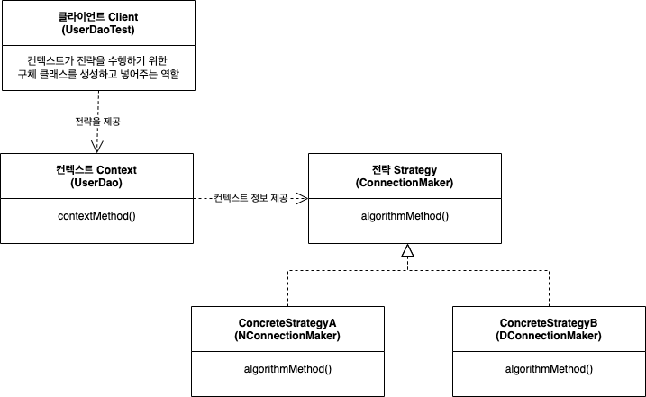
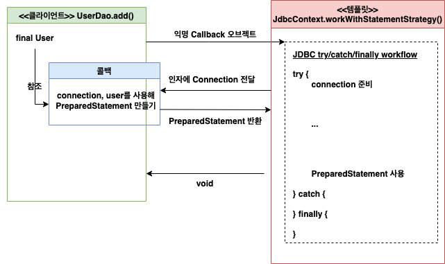

# 3장: 템플릿

1장에서는 DI를 중심적으로 살펴봤습니다. 이 과정에서 관심사를 분리하고 확장과 변경에 용이하게 대응하는 구조를 만들며 객체지향의 원칙을 지켰을 때 어떤 장점들이 있는지를 같이 확인했다.

UserDao는 커넥션 연결 방법을 ConnectionMaker 인터페이스를 상속하는 클래스를 추가해 자유롭게 확장할 수 있었고 이를 확장하더라도 UserDao에 아무런 변경도 끼치지 않았다. 이 때 지킨 객체지향 원칙이 **개방-폐쇄 원칙 Open-Closed Principle**이었다.

이번 장에서는 자주 변경되는 성질을 가지는 부분과 거의 변경이 일어나지 않고 일정한 패턴으로 유지되는 특성을 가진 부분을 서로 독립시켜서 효과적으로 활용할 수 있도록 만드는 템플릿 기법을 알아보겠다.

### INDEX

1. **다시 보는 초난감 DAO**
2. **변하는 것과 변하지 않는 것**
3. **JDBC 전략 패턴의 최적화**
4. **컨텍스트와 DI**
5. **템플릿과 콜백**
6. **스프링의 JdbcTemplate**

---

### 1. 다시 보는 초난감 DAO

- UserDao의 deleteAll() 코드는 예외를 처리하는 부분에서 부족한 부분이 있다.
    
    ```java
    public void deleteAll() throws SQLException {
        Connection connection = dataSource.getConnection();
    
        // prepareStatement를 호출하다가 예외가 발생하는 경우 statement와 connection이 정상적으로 닫히지 않는다.
        PreparedStatement ps = connection.prepareStatement("delete from users");
        ps.executeUpdate();
    
        ps.close();
        connection.close();
    }
    ```
    
    - 에러가 발생하면 Conneciton, PreparedStatement을 정상적으로 반환하지 못한다.
    - 서버에서는 대부분 일정 갯수의 DB 커넥션을 만들고 풀에 넣어놓은 뒤 재사용한다.
    - 정상적으로 반환하지 못하면 결국 사용할 수 있는 커넥션의 개수가 부족해 리소스 부족 에러가 발생한다.
    
- 하지만 문제는 또 있다. 리소스를 반환하는 코드조차 SQLException이 발생할 수 있기 때문에 try/catch문으로 감싸줘야 한다.
    
    ```java
    public void deleteAllWithTryCatch() throws SQLException {
        Connection conn = null;
        PreparedStatement ps = null;
    
        try {
            conn = dataSource.getConnection();
            ps = conn.prepareStatement("delete from users");
            ps.executeUpdate();
        } catch (SQLException e) {
            throw e;
        } finally {
            if( ps != null){
                try {
                    ps.close();
                } catch (SQLException e){}
            }
            if(conn != null){
                try {
                    conn.close();
                } catch (SQLException e){}
            }
        }
    }
    ```
    
    - 하지만 이 경우 너무 소스가 더러워진다.
        - null 체크 부분을 isNonNull()로 추출할까 했지만 이미 더러워진 흙탕물에 쓰레기 하나 더 빠진다고 달라질게 없어보여 그만뒀다.
        - 그리고 우린 더 멋지게 개선할 예정이다.

- 이번엔 조회 쿼리다. 위와 마찬가지로 어마어마하게 더럽다.
    
    ```java
    public int getCount() throws SQLException {
        Connection conn = null;
        PreparedStatement ps = null;
        ResultSet rs = null;
    
        try {
            conn = dataSource.getConnection();
    
            ps = conn.prepareStatement("select count(*) from users");
    
            rs = ps.executeQuery();
            rs.next();
            return rs.getInt(1);
        } catch (SQLException e){
            throw e;
        } finally {
            if( rs != null){
                try {
                    rs.close();
                } catch (SQLException e){}
            }
            if( ps != null){
                try {
                    ps.close();
                } catch (SQLException e){}
            }
            if(conn != null){
                try {
                    conn.close();
                } catch (SQLException e){}
            }
        }
    }
    ```
    

---

### 2. 변하는 것과 변하지 않는 것

- try/catch/finally 구문을 통해 리소스에 대한 예외 처리를 해놓았기 때문에 위 메서드들은 정상적으로 작동한다.
    - 하지만 코드가 너무 복잡하며 메소드마다 코드가 반복된다. 심지어 대부분은 복사 + 붙여넣기다.
    - 인간은 항상 실수를 반복하기 때문에 이 방법은 위험성이 너무 높다. 어떻게 개선해야 할까?
    
- 우선 가장 먼저 할 수 있는 것은 역시 성격이 다른 관심사를 분리해내는 것이다.
    - Connection, PreparedStatement 등의 리소스를 선언하는 부분, statement를 실행하는 부분, 리소스를 반환하는 부분이 똑같이 반복되는 것을 확인할 수 있다.
    - 이 부분을 어떻게 재사용할 수 있을까?
    - 첫 번째로는 메서드 추출이다.
        
        ```java
        public void deleteAllWithTryCatch() throws SQLException {
            ...
            conn = dataSource.getConnection();
            ps = makeStatement(conn);
            ps.executeUpdate();
        		...
        }
        
        private PreparedStatement makeStatement(Connection conn) throws SQLException {
            return conn.prepareStatement("delete from users");
        }
        ```
        
        - 메서드 추출은 해냈지만 분리시킨 메서드를 다른 곳에서 사용할 수 없기 때문에 크게 와닫지 않는다.
    - 두 번째는 템플릿 메서드 패턴의 적용이다. 이건 UserDao의 makeConnection() 메서드에서 상세 구현이 달라지는 경우 사용했었다.
        
        ```java
        public class UserDao {
        		...
        		abstract protected PreparedStatement makeStatement(Connection conn) throws SQLException;
        		...
        }
        
        public class UserDaoDeleteAll extends UserDao {
            @Override
            protected PreparedStatement makeStatement(Connection conn) throws SQLException {
                PreparedStatement ps = conn.prepareStatement("delete from users");
                return ps;
            }
        }
        ```
        
        - 슈퍼 클래스에서 공통 로직을 정의해놓고 변하는 부분은 추상 메서드로 둔 채 상속을 통해 하위 클래스에서 구현하도록 하는 방법이다.
        - 템플릿 메서드 패턴을 사용하는 경우 상속을 통해 자유롭게 확장할 수 있다.
        - 하지만 이 역시 쿼리가 달라질 때마다 새로운 클래스를 만들어야 하는 클래스 폭발 문제가 발생한다.
        - 또한 클래스의 상속을 통한 확장 구조가 컴파일 타임에 고정되어 버려 유연한 설계가 불가능하다.

- 전략 패턴을 사용해보자.
    - 오브젝트를 아예 둘로 분리하고 클래스 레벨에서는 인터페이스를 통해서만 의존하도록 만드는 전략이다.
        - 개방 폐쇄 원칙을 잘 지키면서도 템플릿 메서드 패턴보다 유연하고 확장성이 뛰어난 디자인 패턴이다. DaoFactory를 만들 때 적용시켰었다.
        - OCP 관점으로 보면 확장에 해당하는 변하는 부분을 별도의 클래스로 만들고
        - 이를 추상화된 인터페이스를 통해 위임하는 방식이다.
        
        <p align="center"></p>
        
        Context의 contextMethod()에서 일정한 구조(변하지 않는 곳과 변하는 곳)를 가지고 동작하다가 특정 확장 기능(변하는 곳)은 Strategy 인터페이스를 통해 외부의 독립된 전략 클래스에 위임
        
        - Context: 변하지 않는 기능의 동작 흐름이다.
        - contextMethod: 컨텍스트 내부에서 변하지 않는 무엇이다.
        - Streategy: 컨텍스트 내부에서 자주 변경되는 곳을 대체하는 무엇이다.
        - Client: Strategy를 컨텍스트 내부가 갖고 있으면 결합도가 상승한다. 따라서 이를 선택하고 주입해주는 역할을 담당하는 역할이 필요하다. 이를 수행하는 무엇이다.
        
        > *클라이언트가 필요한 이유는 컨텍스트에서 전략을 사용하기 위해선 결국 구현 클래스를 직접 생성자를 통해 넣어줘야 했다. 그 역할을 클라이언트가 대신해준다.*
        > 
    - deleteAll()의 컨텍스트는 아래와 같다.
        1. *DB 커넥션 가져오기* 
        2. *PreparedStatement를 만들어줄 외부 기능 호출하기* 
        3. *전달받은 PreparedStatement 실행하기* 
        4. *예외가 발생하면 이를 다시 메서드 밖으로 던지기* 
        5. *모든 경우에 만들어진 PreparedStatement와 Connection을 적절히 닫아주기* 
    - 여기서 컨텍스트는 변하지 않는 부분인 DB를 업데이트하는 작업이며, 컨텍스트 메서드는 deleteAll() 내부에서 쿼리를 날리는 부분이다. 그리고 전략은 PreparedStatement를 만들어주는 기능이다.
    
- 즉 전략(자주 변경되는 부분)인 PreparedStatement를 만들어주는 기능을 인터페이스로 만든 뒤 인터페이스의 메서드를 통해 PreparedStatement를 생성하도록 하자.
    - AS-IS
        
        ```java
        // TO-BE
        // 전략을 인터페이스로 구현
        public interface StatmentStrategy {
        		PreparedStatement makePreparedStatement(Connection conn) throws SQLException;
        }
        
        // 인터페이스로 생성한 전략을 상속(구현)하는 구체 클래스 
        public class DeleteAllStatement implements StatementStrategy {
        	public PreparedStatement makePreparedStatement(Connection c) throws SQLException {
        			return conn.prepareStatement("delete from users");
        	}
        }
        
        public class UserDao {
        		...
        		public void deleteAll() {
        			...
        			try {
        					c = dataSource.getConnection();
        			
        					StatmentStrategy strategy = new DeleteAllStatement();
        					ps = strategy.makePreparedStatement(c);
        			
        					ps.executeUpdate(); 	
        			} catch (SQLException e) {
        				...
        		}
        		...
        }
        ```
        
    - TO-BE
        
        ```java
        public void deleteAll() {
        
        	// 고정되는 부분 ~
        	Connection c = null;
        	PreparedStatement ps = null;
        	...
        	try {
        			c = dataSource.getConnection(); // 여기까지 고정됨
        			ps = c.prepareStatement("delete from users"); // 변하는 부분
        			ps.executeUpdate();
        	} 
        	...
        }
        ```
        
        - 여기서도 결국은 구체 클래스를 직접 new 생성자(DeleteAllStatement)를 통해 컨텍스트 안에서 생성과 사용을 제어하고 있다.
        - UserDao의 ConnectionMaker의 구체 클래스를 생성자 안에서 직접 new 연산자로 생성하던 것과 같은 패턴이다.
        - 이를 해결하기 위해 컨텍스트(UserDao)가 필요로 하는 전략(ConnectionMaker)의 특정 구현 클래스(DConnectionMaker) 오브젝트를 클라이언트(UserDaoTest)가 만들어서 제공하는 방법을 사용했다.
        
- 이 때 필요한건 역시 클라이언트다.
    - 여기서 우리가 신경 써야하는 부분은 UserDao의 데이터베이스 연결과 관련된 부분인 컨텍스트와 Statement를 서로 분리시켜야 한다는 점이다.
        - 컨텍스트를 별도의 메서드로 독립시키자.
        
        ```java
        public class UserDao {
        	
        	// deleteAll이 클라이언트 역할을 수행한다
        	public void deleteAll() throws SQLException {
        
        			// 선정한 전략 클래스의 오브젝트 생성
        			StatemetStrategy st = new DeleteAllStatement();
        			
        			// 컨텍스트 호출하고, 전략 오브젝트를 전달한다
        			jdbcContextWithStatementStrategy(st);
        	}
        	
        	// 컨텍스트를 별도의 메서드로 분리, 여기서 인자로 전달받는 StatementStrategy는 클라이언트가 컨텍스트를 호출할 때 넘겨준다
        	public void jdbcContextWithStatementStrategy(StatementStrategy deleteAllStatement) throws SQLException {
        			Connection c = null;
        			PreparedStatement ps = null;
        			
        			try {
                    conn = dataSource.getConnection();
                    ps = deleteAllStatement.makePreparedStatement(conn);
                    ps.executeUpdate();
              }
        			...
        	}
        }
        ```
        
        - 여기서 우린 기존 컨텍스트 역할을 하던 deleteAll()을 jdbcContextWithStatementStrategy()로 분리한 뒤 이를 호출하도록 구조를 바꿨다.
        - 따라서 deleteAll()이 클라이언트, jdbcContextWithStatementStrategy()가 컨텍스트가 되었다.
        - 비록 둘의 클래스가 분리되지 않았지만 전략 패턴에서 의도한 바를 잘 수행하고 있다.

---

### 3. JDBC 전략 패턴의 최적화

- 우리는 앞서 변하지 않는 컨텍스트와 자주 변하는 핵심 로직을 전략 패턴을 사용해 분리해내었다.
    - 이번엔 add() 메서드에 적용해보자.
        
        ```java
        public class AddStatement implements StatementStrategy {
        
            private User user;
        
            public AddStatement(User user) { this.user = user; }
            @Override
            public PreparedStatement makePreparedStatement(Connection conn) throws SQLException {
                PreparedStatement preparedStatement = conn.prepareStatement("insert into users(id, name, password) values (?, ?, ?)");
                preparedStatement.setString(1, user.getId());
                preparedStatement.setString(2, user.getName());
                preparedStatement.setString(3, user.getPassword());
                return preparedStatement;
            }
        }
        ```
        
    - AddStatement 구현체에서 User 정보를 생성자로부터 전달받을 수 있도록 했다.
        
        ```java
        public class UserDao { 
        		public void add(User user) throws SQLException {
        				StatementStrategy st = new AddStatement(user);
        				jdbcContextWithStatementStrategy(st);
        		}
        }
        ```
        

- 하지만 여기서도 역시 불만이 있다. 인터페이스를 통해 구현 클래스를 쿼리마다 생성해줘야 한다는 것이다.
    - 즉 여기서도 클래스 폭발 문제가 발생한다.
    - 런타임에서 동적으로 오브젝트를 DI해준다는 점을 제외하면 템플릿 메서드 패턴과 똑같다.
    - 이 문제는 어떻게 해결해야 할까.
    
- 첫 번째 해결책은 로컬 클래스다.
    - 클래스 생성이 많아진다? 그렇다면 생성하지 않으면 된다. 심지어 DeleteAllStatement와 AddStatement는 DAO 외부에서 사용되지 않는 클래스다.
    - 클래스 폭발 문제가 발생하는 전략의 구현체들을 파일이 아닌 로컬 클래스로 정의해버리자.
        - 로컬 변수를 선언해서 사용하는 것처럼 클래스를 생성해 사용하는 방식이다.
    
    ```java
    public class UserDao {
    	public void add(final User user) throws SQLException {
          class AddStatement implements StatementStrategy {
              @Override
              public PreparedStatement makePreparedStatement(Connection conn) throws SQLException {
                  PreparedStatement preparedStatement = conn.prepareStatement("insert into users(id, name, password) values (?, ?, ?)");
                  preparedStatement.setString(1, user.getId());
                  preparedStatement.setString(2, user.getName());
                  preparedStatement.setString(3, user.getPassword());
                  return preparedStatement;
              }
          }
    
          // add 메서드 내부 로직을 위에서 생성한 로컬 클래스를 통해 수행
          StatementStrategy st = new AddStatement();
          jdbcContextWithStatementStrategy(st);
      }
    }
    ```
    
    - 이렇게 클래스 내부에 새롭게 정의되는 클래스를 중첩 클래스라고 한다.
        - 중첩 클래스는 독립적인 오브젝트로 만들어질 수 있는 스태틱 클래스(static class)와
        - 자신이 정의된 클래스의 오브젝트 안에서 만들어질 수 있는 내부 클래스 (inner class)로 구분된다.
            1. 멤버 필드처럼 오브젝트 레벨에 정의되는 멤버 내부 클래스(member inner class)
            2. 메소드 레벨에 정의되는 로컬 클래스(local class)
            3. 이름을 갖지 않는 익명 내부 클래스(annonymous inner class)
        - 세 가지로 생성된다. 우리는 이 중 로컬 클래스를 사용해 문제를 해결했다.
    - 이 때 로컬 클래스는 내부 클래스 종류에 속하기 때문에 자신이 선언된 곳의 정보에 접근할 수 있다.
    - 즉 AddStatement에서 필요로 하는 User 객체를 add()에서 메서드 파라미터로 전달받는 대신 AddStatement에서 직접 사용하자. 이럴 땐 내부 클래스가 외부 변수를 사용하는 것이므로 final 선언을 해주면 된다.
    
- 두 번째 해결책인 익명 내부 클래스다.
    - 어차피 AddStatment 클래스는 add() 메서드에서만 사용된다. 내친 김에 좀더 간결하게 가보자.
    
    ```java
    public class UserDao {
    	public void add(final User user) throws SQLException {
    			// jdbcContext는 데이터베이스 리소스 관련 코드를 의미 with 거기에 자주 변경되는 Statement를 전략 패턴으로 변경한 것
    	    jdbcContextWithStatementStrategy(new StatementStrategy() {
    	        @Override
    	        public PreparedStatement makePreparedStatement(Connection conn) throws SQLException {
    	            PreparedStatement preparedStatement = conn.prepareStatement("insert into users(id, name, password) values (?, ?, ?)");
    	            preparedStatement.setString(1, user.getId());
    	            preparedStatement.setString(2, user.getName());
    	            preparedStatement.setString(3, user.getPassword());
    	            return preparedStatement;
    	        }
    	    });
    	}
    }
    ```
    

---

### 4. 컨텍스트와 DI

- 위에서는 전략 패턴을 적용하고 로컬 클래스, 익명 내부 클래스를 사용해 클래스 폭발 문제를 방지했다.
    
    ```java
    public class UserDao {
    	public void add(final User user) throws SQLException {
    	    jdbcContextWithStatementStrategy(new StatementStrategy() {
    	        @Override
    	        public PreparedStatement makePreparedStatement(Connection conn) throws SQLException {
    	            PreparedStatement preparedStatement = conn.prepareStatement("insert into users(id, name, password) values (?, ?, ?)");
    	            preparedStatement.setString(1, user.getId());
    	            preparedStatement.setString(2, user.getName());
    	            preparedStatement.setString(3, user.getPassword());
    	            return preparedStatement;
    	        }
    	    });
    	}
    }
    ```
    
    - 위 메서드는 전략 패턴이 적용된 add() 메서드를 그대로 가져온 코드다. 구성 요소를 다시 한번 정리해보자.
        - 클라이언트: UserDao의 메서드 add(), deleteAll()
        - 컨텍스트(실행 흐름): jdbcContextWithStatementStrategy() 메서드 (정확히는 메서드의 구조라고 보는게 맞지 않을까)
        - 컨텍스트 메서드(변하지 않는 코드): 전략 부분을 제외한 Connection, PreparedStatement를 생성하고 반환하는 영역
        - 전략(특정 확장 기능): 메서드 내부에서 작성+실행되는 SQL을 반환하는 익명 내부 클래스
    - 이 때 jdbcContextWithStatementStrategy() 메서드는 다른 DAO에서도 재사용이 가능하다. 따라서 이를 UserDao 클래스 밖으로 독립시키자.
    
- 메서드를 분리해놓을 클래스를 생성하고 옮겨보자. 이름은 JdbContext다.
    
    ```java
    public class JdbcContext {
        private DataSource dataSource;
    
        public void setDataSource(DataSource dataSource) {
            this.dataSource = dataSource;
        }
    
        public void workWithStatementStrategy(StatementStrategy stmt) throws SQLException {
            Connection conn = null;
            PreparedStatement ps = null;
    
            try {
                conn = this.dataSource.getConnection();
    
                ps = stmt.makePreparedStatement(conn);
                ps.executeUpdate();
    
            } catch (SQLException e) {
                throw e;
            } finally {
                if( ps != null){ try { ps.close();} catch (SQLException e){}}
                if(conn != null){ try { conn.close();} catch (SQLException e){}}
            }
        }
    }
    ```
    
    - 변경 전에 DataSource를 필요로 하던 객체는 UserDao였다. 하지만 지금은 새로 생성된 JdbcContext에서 DataSource를 필요로 한다.
    - setter 메서드를 통해 컨테이너가 수정자 주입을 할수 있도록 변경해주었다.
    
- 이제 UserDao가 JdbcContext를 사용해 쿼리를 날릴 수 있도록 바꿔보자.
    
    ```java
    public class UserDao {
    		...
        private JdbcContext jdbcContext;
    
        public void setJdbcContext(JdbcContext jdbcContext) {
            this.jdbcContext = jdbcContext;
        }
    
        public void add(final User user) throws SQLException {
            this.jdbcContext.workWithStatementStrategy(new StatementStrategy() {
                @Override
                public PreparedStatement makePreparedStatement(Connection conn) throws SQLException {
                    PreparedStatement preparedStatement = conn.prepareStatement("insert into users(id, name, password) values (?, ?, ?)");
                    preparedStatement.setString(1, user.getId());
                    preparedStatement.setString(2, user.getName());
                    preparedStatement.setString(3, user.getPassword());
                    return preparedStatement;
                }
            });
        }
    
    		public void deleteAll() throws SQLException {
            this.jdbcContext.workWithStatementStrategy(new StatementStrategy() {
                    @Override
                    public PreparedStatement makePreparedStatement(Connection conn) throws SQLException {
                        return conn.prepareStatement("delete from users");
                    }
                }
            );
        }
    }
    ```
    

- 자 여기서 한번 생각해보자, 지금까지의 DI는 클래스 레벨에서 세부사항(인터페이스를 구현한 구체 클래스)와 의존관계가 생기지 않도록 인터페이스를 적용했다.
    - 그런데 여기선 JdbcContext 구체 클래스를 직접 주입받아서 사용하고 있다.
    - 인터페이스를 사용하지 않았으니 올바르지 않은 것일까?
    - 인터페이스를 두는 목적은  컴파일 시점에서 세부 구현사항에 대한 의존관계를 끊고, 런타임에 동적으로 관계를 주입해주는 것이다.
    
- 그렇다면 JdbcContext와 UserDao 사이를 왜 DI 구조로 바꾼 것일까?
    - JDBC 컨텍스트 메소드를 제공해주는 서비스 오브젝트로써의 가치를 갖는다.
        - 또한 필드로 갖고 있는 필드도 상태를 갖고 있지 않다.
    - DI를 통해 다른 빈에 의존하고 있다. dataSource 프로퍼티를 통해 DataSource 객체를 주입받는다.
        - 앞서 말했듯 스프링 컨테이너를 통해 빈을 주입받으려면 주입받는 본인도 컨테이너에 빈으로 등록되어 있어야 한다.
    - 인터페이스를 사용하지 않는 이유는 무엇일까?
        - 인터페이스가 없으면 두 클래스는 강하게 서로 결합된다. 즉 반드시 둘은 뭉쳐있어야 한다.
        - 만약 데이터베이스를 핸들링할 때 JDBC가 아닌 ORM을 사용한다면 JdbcContext는 분명 다른 구현으로 변경되야 한다. 이럴 땐 인터페이스를 사용하지 않아도 좋다.
        
- 수동 DI를 적용해보자
    - 현재의 의존 관계는 UserDao → JdbcContext → DataSource이고 세 클래스 각기 다른 @Bean을 통해 모두 스프링 컨테이너에게 객체를 주입받고 있다.
    - 이를 UserDao가 DataSource를 컨테이너에게 주입받아 JdbcContext에 넣어주도록 바꿔보자.
        - 이 과정에서 JdbContext는 싱글톤이 보장되지 않고, Dao마다 하나씩 생성된다.
        - 갯수가 몇만개가 되는 것도 아니고, 상태 정보도 없다. 또한 객체의 라이프사이클이 짧은 것이 아니기에 괜찮을 것이다.
    
    ```java
    public class UserDao {
    	...
    	private DataSource dataSource;
    	private JdbcContext jdbcContext;
    	
    	// 수정자 메서드임과 동시에 JdbcContext를 생성하고
    	// 스프링 컨테이너로부터 주입받은 DataSource를 주입해주는 역할까지 수행한다.
    	public void setDataSource(DataSource dataSource) {
    			this.jdbcContext = new JdbcContext();
    			
    			this.jdbcContext.setDataSource(dataSource);
    
    			this.datasource = datasource;
    	}
    }
    ```
    
    - 이렇게 변경한 이유는 UserDao와 JdbcContext는 위에서 말했듯, 굉장히 긴밀한 관계를 가져 굳이 빈으로 처리할 필요가 없다는 것이 첫 번째였고
    - 두 번째로는 내부에서 의존성을 갖는 객체를 직접 생성함과 동시에 다른 오브젝트에 대한 DI를 직접 본인이 제어할 수 있기 떄문이다.
        - 이를 통해 외부에 컴파일 단계에서 구체적인 의존관계가 노출되는 문제점을 해결할 수 있다.

---

### 5. 템플릿과 콜백

- 우리는 앞서 전략 패턴을 활용해 StatementStrategy 구현체를 변경하도록 만들었고, 그 구현체는 익명 내부 클래스를 통해서 전달했다.
    - 이런 방식을 스프링에서는 템플릿/콜백 패턴이라고 부른다.
    - 이 때 전략 패턴의 컨텍스트를 템플릿이라고 부르며, 익명 내부 클래스로 생성되는 오브젝트를 콜백이라고 부른다.
    - 즉, 고정된 작업을 수행해야할 때 그 안에 변경되어야 하는 작업만 ‘콜백(실행되는 것이 목적인 객체)'을 통해 수행할 수 있도록 넣어주는 것이다.
    - 상태 전략은 여러 개의 메서드를 가진 인터페이스를 사용할 수 있지만, 템플릿/콜백 패턴은 주로 단일 메서드 인터페이스를 사용한다.

<p align="center"></p>

<p align="center"></p>

- 여기서 한 가지 아쉬운 점이 있다면 익명 내부 클래스를 생성하다보니 코드의 가독성이 떨어진다는 것이다.
    - 콜백 오브젝트에서 변하지 않는 부분을 찾고 분리시켜보자.
        
        ```java
        public void deleteAll() throws SQLException {
            this.jdbcContext.workWithStatementStrategy(
                    // 콜백 오브젝트가 생성되는 로직은 번하지 않는다
                    new StatementStrategy() {
                        @Override
                        public PreparedStatement makePreparedStatement(Connection conn) throws SQLException {
                            // 변하는 곳은 prepareStatement의 sql 인자뿐이다
                            return conn.prepareStatement("delete from users");
                        }
                    }
            );
        }
        ```
        
        - 여기서 “delete from user”는 변하지만 콜백 클래스를 생성하는 코드는 변하지 않는다.
        - 분리시켜보자.
            
            ```java
            public void deleteAll() throw SQLException {
            		executeQuery("delete from users");
            }
            
            private void executeSql(final String query) throws SQLException {
                this.jdbcContext.workWithStatementStrategy(
                        new StatementStrategy() {
                            @Override
                            public PreparedStatement makePreparedStatement(Connection conn) throws SQLException {
                                // 변하는 곳을 인자로 받을 수 있도록 메서드로 추출
                                return conn.prepareStatement(query);
                            }
                        }
                );
            }
            ```
            
        - 바뀌지 않는 모든 부분은 빼내어 메서드로 재정의했다. 변하지 않는 것과 변하는 것을 분리한 뒤 유연하게 재활용하게 만드는 것은 코드를 단순하고 안전하게 만들어준다.
        
- 이 메서드는 DAO 전체에서 모두 사용 가능할 것이다. UserDao가 아닌 jdbcContext로 옮기자. JdbcContext는 이제 클라이언트, 템플릿, 콜백을 모두 가지고 있게 되었다.
    
    ```java
    public class JdbcContext {
    		...
    		public void executeSql(final String query) throws SQLException {
            workWithStatementStrategy(
                    new StatementStrategy() {
                        @Override
                        public PreparedStatement makePreparedStatement(Connection conn) throws SQLException {
                            // 변하는 곳을 인자로 받을 수 있도록 메서드로 추출
                            return conn.prepareStatement(query);
                        }
                    }
            );
        }
    }
    ```
    
    - 기존에 UserDao는 이제 jdbcContext를 사용하게 되고, 매번 익명 내부 클래스를 새로 작성했던 코드의 가독성 문제를 치워버릴 수 있게 되었다.
        
        ```java
        public class UserDao {
        		...
        		public void deleteAll() throws SQLException {
        				this.jdbcContext.executeSql("delete from users");
        		}
        }
        ```
        

- 파일을 읽고, 안에 있는 숫자를 모두 더해 반환하는 계산기를 만들어보자.
    
    ```java
    public class Calculator { 
    		public Integer calcSum(String filepath) throws IOException {
    				BufferedReader br = null;
    
    				try { 
    						// 파일을 읽기 위한 BufferedReader를 생성하고, 필요한 변수들을 생성하는 부분 -> 템플릿으로 변환하는 것이 좋아보인다.
    						br = new BufferedReader(new FileReader(filepath));
    						Integer sum = 0;
    						String line = null;
    						
    						while((line = br.readLine()) != null) {
    								sum += Integer.valueOf(line);
    						}
    						return sum;	
    				} catch (IOException e) {
    						System.out.println(e.getMessage());
    						throw e;
    				} finally {
    						if(br != null) {
    								try { br.close(); }
    								catch(IOException e) { System.out.println(e.getMessage()); }
    						}
    				}
    		}
    }
    ```
    
    - 자, 템플릿/콜백 패턴을 적용해보자. 이 때 우리는 템플릿에 담을 반복되는 작업 흐름은 무엇인지, 콜백이 템플릿에게 넘겨줄 정보는 무엇인지 그 경계를 정하는게 먼저다.
        - 템플릿은 고정적으로 수행하는 고정적인 동작이라고 했다. 파일을 열고 읽는 행위는 항상 필요하며 반복되므로 템플릿으로 빠질만해 보인다.
        - 그렇다면 BufferedReader를 만들어 작업을 수행하는 콜백에게 넘겨주자.
        - 콜백은 이를 받아, 파일을 읽어 기능(여기서는 더하기 계산)을 수행한 뒤 결과값을 템플릿에게 넘어주면 맞아 떨어진다.
        
- 그렇다면 위 코드를 템플릿/콜백 패턴으로 변경해보자.
    - 위에서 파일을 열고 읽기 위한 코드 부분은 템플릿으로, 변경될 가능성이 있는 작업을 수행하는 것은 콜백에게 맡기도록 계획했다.
    - 또 하나 필요한 것은 클라이언트다. 작업을 수행할 콜백을 생성한 뒤 템플릿에게 전달하는 역할을 수행해야 한다. 이건 맨 처음 작성했던 calcSum()이 담당하게 하자.
    - 우선 중복되는 부분을 수행할 템플릿부터 만들어보자.
        
        ```java
        public interface BufferedReaderCallback {
        		Integer doSomethingWithReader(BufferedReader br) throws IOException;
        }
        
        public class Calculator {
        		...
        		public Integer fileReadTemplate(String filepath, BufferedReaderCallback callback) throws IOException {
        				BufferedReader br = null;
        		
        				try {
        						br = new BufferedReader(new FileReader(filepath));
        						return callback.doSomethingWithReader(br);
        				} catch (IOException e) {
        						System.out.println(e.getMessage());
        						throw e;
        				} finally {
        						if(br != null) {
        								try { br.close(); }
        								catch(IOException e) { System.out.println(e.getMessage()); }
        						}
        				}
        		}
        }
        ```
        
        - BufferedReader를 생성하는 작업과 그 외의 번거로운 작업이 template 내부에서 수행하며, 변경되는 작업만 콜백이 수행하도록 변경했다. 이 때 콜백은 클라이언트가 외부에서 생성해 템플릿에게 전달해준다.
        
- 자 이제 클라이언트가 템플릿을 사용할 수 있도록 변경해보자.
    
    ```java
    public class Calculator { 
    		// 클라이언트의 역할을 하는 calcSum()
    		public Integer calcSum(String filepath) throws IOException {
    
    				// 템플릿에서 사용할 콜백을 생성하는 책임을 수행
    				BufferedReaderCallback sumCallback = 
    						// 인터페이스로 생성해놓은 것에 대해 구현체를 만들어 변경되는 작업을 수행할 콜백(구현체)을 생성한다. 
    						new BufferedReaderCallback() {
    								public Integer doSomethingWithReader(BufferedReader br) throws IOException {
    										Integer sum = 0;
    										String line = null;								
    										while((line = br.readLine()) != null) {
    												sum += Integer.valueOf(line);
    										}
    										return sum;	
    								}
    						};
    
    				// 변경되는 작업을 수행하는 콜백을 전달받아 전체 기능을 수행하는 템플릿을 호출해 전체 기능을 수행
    				return fileReadTemplate(filepath, sumCallback);
    		}
    
    		public Integer fileReadTemplate(String filepath, BufferedReaderCallback callback) throws IOException {
    				...
    		}
    }
    ```
    
    - 만약 더하기가 아니라 뺄셈이 들어와도 multiplyCallback을 구현해 템플릿에 전달해주기만 하면 끝이다.
    - (multiplyCallback을 구현했다고 가정하고) 여기서도 중복이 발생한다. 템플릿과 콜백은 변하는 부분과 변하지 않는 부분, 변하지 않는 부분에서 변하는 부분으로 어떤 정보를 전달하는지를 살펴보면 됐다. 콜백에서 변하지 않는 부분을 템플릿으로 이식해보자.
        - 변하지 않는 부분은 Integer result 변수 선언과 실제 연산을 진행하는 `sum += ~, multiply *= ~` 을 제외한 while문이다.
        - 변하는 부분은 위에서 언급한 `sum += ~, multiply *= ~` 부분이다.
        
- 변하지 않는 부분을 콜백에서 템플릿으로 이식하자.
    - 콜백에 남겨놓을 부분은 반복문 안에서 각 라인별로 결과값에 연산 결과를 더해주는 부분이다.
        
        ```java
        public interface LineCallback {
        		Integer doSomethingWithLine(String line, Integer value) throws IOException; 
        }
        
        public Integer lineReadTemplate(String filepath, LineCallback callback, int initVal) throws IOException {
        		BufferedReader = null;
        
        		try {
        				br = new BufferedReader(new FileReader(filepath));
        				Integer result = initVal;
        
        				String line = null;
        				// 파일의 각각 라인을 읽는 부분을 템플릿으로 빼내었다
        				while((line = br.readLine()) != null) {
        						// 라인을 계산하는 부분(변하는 부분)만 콜백에 남겨놔 콜백이 수행하도록 했다
        						result = callback.doSomethingWithLine(line, result); // +=와 같은 맥락인 것을 확인할 수 있다. 
        				}
        				return result;
        		}
        }
        ```
        
    - 자 다시 클라이언트인 calcSum()으로 가서 새로운 템플릿과 콜백을 사용하도록 해보자.
        
        ```java
        public class Calculator { 
        		// 클라이언트의 역할을 하는 calcSum()은 그대로다
        		public Integer calcSum(String filepath) throws IOException {
        				// 콜백의 종류가 변경되었다
        				LineCallback lineCallback = 
        						new LineCallback() {
        								// 기존 BufferedRedaerCallback에 있던 while문이 깔끔하게 템플릿으로 이식돼 사라졌다
        								public Integer doSomethingWithLine(String line, Integer value) {
        										return value + Integer.valueOf(line);
        								}
        						};
        				// while문과 초기값의 반복되는 영역을 포함한 새로운 템플릿에게 콜백을 전달한다.
        				return lineReadTemplate(filepath, lineCallback);
        		}
        
        		public Integer lineReadTemplate(String filepath, LineCallback callback, int initVal) throws IOException {
        				...
        		}
        }
        ```
        
    - 이제 콜백에는 맨 처음 정의했던 기능 중 핵심 부분인 연산만 들어가있다. 또한 이를 곱하기, 뺄셈과 상관없이 콜백의 로직만 바꿔주면 무한한 확장이 가능하다. 아 사실 무한한 확장은 아니다. 아닌 이유를 알아보자.
    
- 만약  문자열을 합쳐야 한다면 어떻게 해야할까? 그때도 지금과 같은 템플릿/콜백 패턴을 사용할 수 있을까? 불가능하다. calcSum의 리턴 타입이 Integer이기 때문이다. 이는 어떻게 해결할까?
    - 자바는 5부터 제네릭을 지원한다. 이를 사용하면 문자열에 동일한 템플릿/콜백 패턴을 적용할 수 있다.
        
        ```java
        public interface LineCallbackWithGeneric<T> {
        		T doSomethingWithLine(String line, T value) throws IOException;
        }
        
        public String concatenate(String filepath) throws IOException {
            LineCallbackWithGeneric<String> callbackWithGeneric = new LineCallbackWithGeneric<String>() {
                @Override
                public String doSomethingWithLine(String line, String value) throws IOException {
                    return value + line;
                }
            };
        
            return lineReadTemplateWithGeneric(filepath, callbackWithGeneric, "");
        }
        
        public <T> T lineReadTemplateWithGeneric(String filepath, LineCallbackWithGeneric<T> callback, T initVal) throws IOException {
                BufferedReader bufferedReader = null;
        
                try {
                    bufferedReader = new BufferedReader(new FileReader(filepath));
                    T result = initVal;
        
                    String line = null;
                    while ((line = bufferedReader.readLine()) != null) {
                        result = callback.doSomethingWithLine(line, result);
                    }
                    return result;
        
                } ...
        }
        ```
        

---

### 6. 스프링의 JdbcTemplate

- 우리가 앞서 UserDao에서 작성한 대부분의 메서드는 스프링이 지원하는 JdbcTemplate으로 변경할 수 있다.
    
    ```java
    public class UserDao {
        private JdbcTemplate jdbcTemplate;
    
    		...
    
        public void setDataSource(DataSource dataSource) {
            this.dataSource = dataSource;
            this.jdbcTemplate = new JdbcTemplate(dataSource);
        }
    }
    ```
    

- 5장까지는 JdbcContext 클래스의 executeSql에 문자열로된 쿼리를 전달해주면 전략 패턴을 이용해 미리 준비했던 콜백을 만들고 템플릿을 호출해 진행했었다.
    - 놀랍게도 이미 스프링은 이런 방식을 차용하고 있어서 우리는 그저 사용하기면 된다.
        
        ```java
        public class UserDao {
        		...		
            public void deleteAllWithTemplateCallback(){
                this.jdbcTemplate.update(
                        new PreparedStatementCreator() {
                            @Override
                            public PreparedStatement createPreparedStatement(Connection con) throws SQLException {
                                return con.prepareStatement("delete from users");
                            }
                        }
                );
            }
        
            public void deleteAllWithOnlyParam(){
                this.jdbcTemplate.update("delete from users");
            }
        		...
        }
        ```
        
    - 앞서 구현하지 못했던 add()도 가능하다.
        
        ```java
         public void add(User user){
              this.jdbcTemplate.update("insert into users (id, name, password) values (?, ?, ?)", user.getId(), user.getName(), user.getPassword());
          }
        ```
        
    - getCount()다. 이 경우는 add, deleteAll()과는 다르게 전달받을 결과값이 존재한다.
        
        ```java
        public int getCount() {
            return this.jdbcTemplate.query(
                    // 쿼리를 수행하는 콜백
                    new PreparedStatementCreator() {
                        @Override
                        public PreparedStatement createPreparedStatement(Connection con) throws SQLException {
                            return con.prepareStatement("select count(*) from users");
                        }
                    },
                    // 쿼리의 결과를 전달받는 콜백
                    new ㅊ<Integer>() {
                        public Integer extractData(ResultSet rs) throws SQLException, DataAccessException {
                            rs.next();
                            return rs.getInt(1);
                        }
                    }
            );
        }
        ```
        
        - 인자를 가볍게 살펴보면 첫 번째 콜백은 Statement를 생성하는 역할이고, 두 번째 콜백은 ResultSet으로부터 값을 추출하는 역할이다.
        - 이 때 ResultSetExtractor의 파라미터는 제네릭을 사용한다. 그 이유는 추출되는 값의 타입이 다양하기 때문이다.
        - 우리가 넣어준 PreparedStatementCreator 콜백과 ResultSetExtractor 콜백은 메서드의 첫 번째, 세 번째 인자로 들어간다.
        - 하지만 이 역시 콜백 객체를 두 개씩이나 생성하다보니 코드의 가독성이 떨어진다. 그래서 스프링은 queryForX 메서드를 제공한다. 서적에서는 queryForInt()를 소개했지만 3.2.2 버전부터는 deprecated되어 지금은 queryForObject로 대체할 수 있다.
            
            ```java
            public int getCountWithQueryForObject(){
                    return this.jdbcTemplate.queryForObject("select count(*) from users", Integer.class);
                }
            ```
            
    - 다음은 get()이다. 이전 경우들과는 다르게 쿼리의 결과를 객체에 매핑해야한다. 이럴 떈 RowMapper를 사용할 수 있다.
        
        ```java
        public User get(String id){
            return this.jdbcTemplate.queryForObject("select * from users where id = ?",
                    new Object[]{id},
                    new RowMapper<User>() {
                        @Override
                        public User mapRow(ResultSet rs, int rowNum) throws SQLException {
                            User user = new User();
                            user.setId(rs.getString("id"));
                            user.setName(rs.getString("name"));
                            user.setPassword(rs.getString("password"));
                            return user;
                        }
                    }
            );
        }
        ```
        
    - 쿼리의 결과가 여러 로우인 경우 사용할 수 있는 getAll()이다.
        
        ```java
        public List<User> getAll(String id){
            return this.jdbcTemplate.query("select * from order by id",
                    new RowMapper<User>() {
                        @Override
                        public User mapRow(ResultSet rs, int rowNum) throws SQLException {
                            User user = new User();
                            user.setId(rs.getString("id"));
                            user.setName(rs.getString("name"));
                            user.setPassword(rs.getString("password"));
                            return user;
                        }
                    }
            );
        }
        ```
        
    - 여기서도 userMapper 콜백 오브젝트가 반복된다. 인스턴스 변수로 추출해 사용하자.
        
        ```java
        private RowMapper<User> userMapper = new RowMapper<User>() {
            @Override
            public User mapRow(ResultSet rs, int rowNum) throws SQLException {
                User user = new User();
                user.setId(rs.getString("id"));
                user.setName(rs.getString("name"));
                user.setPassword(rs.getString("password"));
                return user;
            }
        };
        
        public int getCountWithQueryForObject(){
            return this.jdbcTemplate.queryForObject("select count(*) from users", Integer.class);
        }
        
        public User get(String id){
            return this.jdbcTemplate.queryForObject("select * from users where id = ?", new Object[]{id}, this.userMapper);
        }
        ```
        

- 위 과정들을 통해 완성된 UserDao는 데이터베이스에서 User 정보를 핸들링하는 핵심적인 로직만 갖고 있다.
    - User 객체와 User 테이블 사이에서의 데이터 교환 고정, SQL 문장 등 최적화된 코드를 갖고 있으며 테이블이 변경되면 대부분의 코드가 바뀐다.
        - 응집도가 높다는 의미다.
    - 반면 JDBC API를 사용하는 방식, 예외처리, 데이터베이스 리소스 관련 책임은 모두 JdbcTemplate에게 있다.
        - 핵심 로직과 데이터베이스 리소스 관련 로직이 서로 낮은 결합도를 의미한다.
        - 하지만 JdbcTemplate 클래스의 템플릿/콜백 구현에 대해선 강한 결합을 갖는다.
        - 하지만 스프링에서 해당 코드들이 표준으로 쓰이고 있고 데이터 액세스 기술이 변경되는 경우만 고려하면 되니 괜찮다.

---

### 7. 정리

- JDBC와 같은 예의가 발생할 가능성이 있는 경우나 공유 리소스의 반환이 필요한 경우는 반드시 try/catch/finally 블록으로 관리하자.
- 작업 흐름에서 일부만 지속해서 변경되는 코드가 있는 경우는 전략 패턴을 적용하자.
    - 바뀌지 않는 부분을 컨텍스트로
    - 변하는 부분을 전략으로 만들어 인터페이스를 활용해
    - 컴파일 의존성을 유연하게 제어하자
- 전략 패턴과 비슷한 전략이 하나 더 있다. 바로 템플릿/콜백 패턴이다.
    - 단일 전략 메서드만을 갖고
    - 전략의 구현체에 익명 내부 클래스를 사용하며
    - 컨텍스트를 호출하며 전략 구현체를 주입해주는 방식을 말한다.