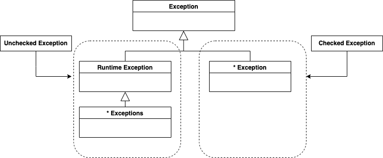
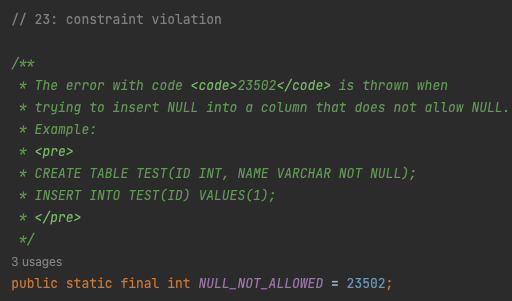
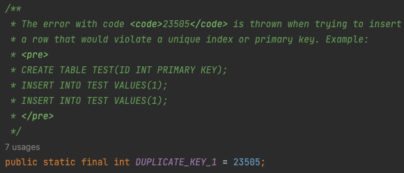

# 4장: 예외

### 머리말

이번 장에서는 JDBCTemplate을 대표로 하는 스프링의 데이터 엑세스 기능에서 예외 처리를 어떤 방식으로 접근하고 있는지 확인해보겠습니다.

### INDEX

1. **사라진 SQLException**
2. **예외 전환**

---

### 1. 사라진 SQLException

- 우리는 앞서 JdbcContext를 스프링이 제공하는 JdbcTemplate으로 교체했었다. 그런데 JdbcTemplate을 사용한 UserDao를 보면 이전에는 항상 작성해줘야 했던 throws SQLException이 사라져있는 것을 확인할 수 있다.
    - 도대체 무슨 일이 있어났길래 이 놈이 사라진걸까?
    - 우선 초난감DAO의 후속 주자인 초난감 예외처리의 예시부터 확인해보자.
- 초난감 예외처리 예시
    
    ```java
    // ex 1
    	...
    } catch (SQLException error){
    	// why is empty?
    }
    
    // ex 2
    	...
    } catch (SQLException error){
    		System.out.println(e);
    }
    
    // ex 3
    	...
    } catch (SQLException error){
    		e.printStackTrace();
    }
    ```
    
    - 위 코드는 예외 블랙홀이라고 불리는 코드다.
        - 에러를 catch절에서 잡은 뒤, 이를 복구하기 위한 코드나 상위 메서드로 에러를 throw하는 코드 어느 하나 존재하지 않는다.
        - 여기서 `e.pritnStackTrace()` , `System.out.println(e)` 로 에러를 찍어주는 코드가 존재하기도 하는데 이 역시 쓸데없는 일이다.
        - 예외를 처리할 때 반드시 지켜야할 핵심 원칙은 모든 예외는 적절하게 복구되든지 아니면 작업을 중단시키고 운영자 또는 개발자에게 통보해야 한다.
        
- 가장 큰 논쟁거리는 checked exception라고 불리는 명시적인 처리가 필요한 예외를 다루는 방법이다
    - 과연 checked의 주체는 무엇일까? 나는 **‘코드 상에서 어떻게 처리할 지 이미 확인된’** 으로 이해했다. 왜냐면 uncheked exception == `RuntimeException`이니까
    - 런타임에서 갑작스레 발생한 예외들은 미리 확인하지 못한 채 발생하는 예외이고, checked exception은 코드 상에서 충분히 발생 가능성을 예측할 수 있는 예외라고 해석했다.
    
- 아래는 자바에서 throw를 통해 발생시킬 수 있는 예외 3가지다.
    
    <p align="center"></p>

    - `java.land.Error`
        - 시스템에서 발생하는 비정상적인 현상, 주로 JVM에서 발생되며 애플리케이션 단에서 처리할 수 없는 문제들을 칭한다.
    - `java.lang.Exception` 와 체크 예외
        - 위에서 말한 것처럼 `RuntimeException`을 상속하지 않는다면 모조리 checked exception이라고 보면 된다. 
        checked exception은 프로그래머가 코드를 작성하며 충분히 예상할 수 있는 예외이기 때문에 이에 대한 처리 코드를 필수적으로 작성하도록 해놓았다.
            
            > *체크 예외를 발생 가능한 예외에 모두 적용하려고 했던 것 같다. 그래서 IOException이나 SQLException을 비롯해서 예외적인 상황에서 던져질 가능성이 있는 것들 대부분이 체크 예외로 만들어져 있다.*
            > 
    - `RuntimeException`과 언체크/런타임 예외
        - 피할 수 있지만 개발자가 부주의해서 발생하는 예외
        - `NullPointerException`
            - 오브젝트를 할당하지 않은 레퍼런스 변수를 사용하려 할 때
        - `IllegalArgumentException`
            - 허용되지 않는 값을 사용해서 메서드를 호출하려 할 때
    
- 자 그렇다면 이렇게 발생한 예외들은 어떻게 처리해야 할까? 어떻게 효과적으로 예외를 처리할 수 있을지 알아보자.
    - 예외 복구
        - 상황을 파악해 정상 상태로 돌려놓는 것, 즉 예외가 발생한 뒤 예외를 복구할 가능성이 존재하는 경우 사용되는 것이 체크 예외다.
    - 예외처리 회피
        - 자신이 해결하지 않고, 자신을 호출한 쪽으로 던져버리는 것이다. 예외처리는 마구잡이로 예외를 상위 호출 메서드로 던져서는 안된다. 객체가 각각 명확한 예외처리 책임을 갖도록 분리한 상태에서 적용되어야 한다.
    - 예외 전환
        
        ```java
        try {
            // success
            userDao.add(stub);
            // throw org.h2.jdbc.JdbcSQLIntegrityConstraintViolationException -> SQLException
            userDao.add(stub);
        } catch (SQLException e) {
            // org/h2/api/ErrorCode.public static final int DUPLICATE_KEY_1 = 23505;
            if(e.getErrorCode() == 23505){
                // convert to proper Exception
                throw new DuplicateUserIdException(e.getCause());
            } else {
                throw e;
            }
        }
        ```
        
        - 예외처리 회피와 비슷하게 메서드 밖으로 에러를 던지지만, 예외를 그대로 넘기지 않고 적절한 예외로 전환해서 던지는 방법이다.
            - 새로운 사용자를 등록할 때 PK가 중복되면 `SQLException` 이 발생한다. 하지만 이건 키가 중복되는 문제 상황을 제대로 설명하지 못한다. 따라서 이를 `DuplicateUserIdException` 으로 전환해서 던져주는 것이 적절한 예시다.
        - 이렇게 분명한 의미가 있는 예외를 던져주면 서비스 계층 오브젝트는 복구 작업의 컨텍스트를 파악하기가 쉬워진다.
    - 그리고 전환한 예외에  원래 발생한 예외를 담아서 던져주는 것이 좋은데 이를 중첩 예외라고 한다. getCause() 메서드를 통해 처음 발생한 예외를 확인할 수 있다.
        - 이 경우는 발생한 예외가 상황을 제대로 설명하지 못할 때, 그 의미를 분명하게 하기 위해서 혹은 예외를 처리하기 쉽도록 포장하려할 때 적절하다.
        - 예외처리를 강제하는 체크 예외를 언체크 예외인 런타임 예외로 바꾸는 경우 사용한다. EJBException이 대표적인 예시다.
        - 애플리케이션의 로직 상에서 발생되는 예외 상황들은 **체크 예외가 적합**하다. 분명 애플리케이션 의도적으로 던지는 예외일 것이기 때문에 적절한 복구 작업이 필요하다.
        
- 정리해보자면 체크 예외는 일반적인 예외였고 반대로 언체크 예외는 시스템 장애나 프로그램 상의 오류였다.
    - 따라서 체크 예외는 우리가 명시적으로 복구 작업에 대한 코드를 작성해줘야 했다.
    - 자바 엔터프라이즈 서버 환경은 수많은 요청이 도달한다. 또한 이 요청들은 독립적인 작업으로 취급되기 때문에 만약 예외가 발생하면 해당 요청(작업)만 중단시키면 끝이다.
    - 왜냐면 독립형 애플리케이션과는 달리 사용자와의 즉각적인 커뮤니케이션이 불가능하기 때문이다.
    - 따라서 애플리케이션 차원에서 예외 상황을 미리 파악한 뒤, 이를 예방하는 것이 낫다. 언체크 예외라면 얼른 개발자에게 통보해주는 것이 낫다.
    - add() 메서드를 살펴보자. 이 때 DuplicatedUserIdException, SQLException 두 가지를 던졌었다.
    - 앞서 DuplicatedUserIdException처럼 명백하게 의미있는 예외라면 런타임 예외로 만드는게 낫다.
        
        ```java
        public class DuplicatedUserIdException extends RuntimeException {
        	public DuplicatedUserIdException(Throwable cause){
        		super(cause);
        	}
        }
        ```
        
    - 다만 add() 메서드를 작성할 때는 명시적으로 DuplicatedUserIdException를 던질 수 있다는 것을 미리 선언해놓아야 한다.
    
- 사실 런타임 예외 중심의 전략은 낙관적인 예외처리 기법이다.
    - 체크 예외가 개발자가 복구할 수 있는 예외라고 가정한 것들이기에, 그 반대인 런타임 예외은 당연히 복구가 못한다고 가정하기 때문이다.
    - 반면 시스템이나 외부 예외 사황이 아닌 애플리케이션 로직에서 의도적으로 발생시키는 예외들도 있다. 이런 예외들은 일반적으로 애플리케이션 예외라고 한다.
        - 예를 들어 출금 기능에서 잔고가 부족한 경우 경고하는 예외가 있을 수 있다.
        - 이 경우는 두 가지 경우로 대처할 수 있다.
            1. 성공했을 때는 0, 실패했을 때는 -1을 리턴하는 경우다. 이 때는 예외를 발생시키지 않는다. 이런 케이스의 문제점은 리턴값의 관리가 되지 않았을 경우다.
                - 의사소통에 대한 문제
                - 사전에 상수로 표준 코드(리턴값의 정책)를 정의두지 않을 경우
                - 둘다 정상 로직이기 때문에 이를 구분하기 위한 if문이 늘어난다.
            2. 정상적인 흐름은 내버려 두고, (잔고 부족같은) 실패 시에만 비즈니스적 의미를 띈 예외를 던진다.
                - 이 때 사용하는 예외는 의도적으로 체크 예외로 만든다.
                - 그래야 개발자가 자주 발생하는 예외상황에 대한 로직을 (강제로) 구현한다.
                
- 결국 우리가 했던 얘기들은 SQLException이 왜 사라졌는가를 설명하기 위해 필요한 내용이다.
    - 사실 SQLException의 대부분은 복구가 불가능하다.
    - 따라서 런타임 예외로 래핑해 던지는 예외처리 전략을 사용해야 한다.
        - 역시는 역시다. 스프링의 JdbcTemplate은 이 전략을 이미 따르고 있다.
            
            > *JdbcTemplate의 템플릿과 콜백 안에서 발생하는 모든 SQLException을 런타임 예외인 DataAccessException으로 포장해서 던져준다.*
            > 
            
            ```java
            /**
             * Pre-checks the arguments, calls {@link #doTranslate}, and invokes the
             * {@link #getFallbackTranslator() fallback translator} if necessary.
             */
            @Override
            @Nullable
            public DataAccessException translate(String task, @Nullable String sql, SQLException ex) {
            	Assert.notNull(ex, "Cannot translate a null SQLException");
            
            	DataAccessException dae = doTranslate(task, sql, ex);
            	if (dae != null) {
            		// Specific exception match found.
            		return dae;
            	}
            
            	// Looking for a fallback...
            	SQLExceptionTranslator fallback = getFallbackTranslator();
            	if (fallback != null) {
            		return fallback.translate(task, sql, ex);
            	}
            
            	return null;
            }
            
            @Nullable
            protected abstract DataAccessException doTranslate(String task, @Nullable String sql, SQLException ex);
            ```
            

---

### 2. 예외 전환

- JDBC는 자바를 이용해서 DB에 접근하는 방법을 추상화된 API 형태로 정의해놓은 것이다.
    - MySql, Oracle과 같은 DB 벤더가 JDBC 표준을 따라서 만든 드라이버를 제공할 수 있도록 한다.
    - 즉 JDBC의 Connection, Statement, Resultset과 같은 인터페이스에만 익숙해지면 뒷단의 세부 구현이 DB에 따라 달라지는걸 신경쓰지 않고 사용할 수 있게 되는 것이다.
    - 다만 여기에도 역시 걸림돌이 있는데, 바로 비표준 SQL이다. DB 벤더마다 비표준 문법을 통한 특정 기능을 제공하고 우린 그것들을 꽤 자주 유용하게 사용한다.
        - 어쩔 수 없이 이런 비표준 SQL을 사용하게 되고 벤더 종속적인 DAO가 되버린다.
    - 아까도 말했듯 JDBC의 예외처리는 단점이 많다.
        - 문법 오류든 DB 커넥션을 가져오지 못하든 테이블과 필드에 문제가 있든 모든 문제를 전부 SQLException에 담아 반환한다.
        - 정확한 이유는 SQLException에 담긴 에러 코드와 DB 상태를 담은 SQL 상태 정보를 참조해야 한다.
            - 문제는 DB 벤더마다 고유한 에러 코드를 사용하기 때문에 각기 다르다는 것
            - 이를 해결하기 위해 DB에 독립적인 SQL 상태 정보를 제공한다.
                
                ex. 통신장애로 인한 DB 실패는 08S01, 테이블 미존재는 42S02
                
            - 하지만 JDBC 드라이버가 이 상태 정보를 정확하게 제공하지 않는다. 즉 확신이 없는 상태 정보를 믿고 DB에 독립적인 코드를 작성하는 것은 사실상 불가능이다.
    - 상태 정보를 믿지 못한다면 어떻게 해야할까. 그나마 믿을 만한건 DB 벤더별 에러 코드다. 하지만 에러 코드 역시 벤더별로 제각각이다.
        - 그렇다면 사용하는 DB별 에러 코드를 해석해주는 기능을 만들어보자.
            - 만약 키 값이 중복된 에러가 오라클에선 1, MySQL이 1062라면
            - 에러 코드에 대한 DB 벤더별 매핑 테이블을 만들어서 해결할 수 있다.
        - 여기서 JdbcTemplate은 SQLException을 단순한 DataAccessException이 아닌 DB 에러코드의 의미를 내포하는 DataAccessException의 서브 클래스를 반환해준다.
            - SQL 문법 → BadSqlGrammerException, DB 커넥션을 못가져오면 → DataAccessResourceFailureException
            
- 이런 문제점을 인식했는지 JDK 1.6부터 포함된 JDBC 4.0은 SQLExcpetion을 좀더 세분화했다.
    - SQL 문법 오류는 SQLSyntaxErrorException, 제약조건 위반은 SQLIntegrityConstraintVioloationExcpetion e등으로
    - 하지만 SQLException의 서브 클래스이기 떄문에 체크 예외라는 문제점은 여전하고, 위에서 말한 오류의 기준이 SQL 상태 정보이기 때문에 아직 문제가 있다.
    
- 우리가 스프링에서 DAO를 따로 만드는 이유는 무엇일까?
    - 관심사의 분리다.
        - 관심사가 데이터 액세스 로직인 코드와 다른 코드를 분리하기 위해서인데, 이것 역시 추상화다.
    - 하지만 전략 패턴(DAO 인터페이스 생성)과 DI를 통해 클라이언트에게 구체 클래스를 감출 수 있어도
    - JDBC를 사용하면 결국 내부에서 던져지는 메서드까지 감추는 것은 불가능하다
    
- 이 문제를 우리는 SQLException을 JdbcTemplate의 기능을 통해 런타임 예외로 포장해 해결했다.
    - 하지만 이후에 나온 JPA, Hibernate와는 동일한 문제여도 예외가 다르다. 따라서 단순히 런타임으로 바꾸는 것만으로는 클라이언트와 DAO의 의존성을 제거할 수가 없다.
    - 따라서 스프링은 DataAccessException에 공통 예외를 정의해놓았다.
        - ex. 데이터 엑세스 기술의 부정확한 사용에 대한 예외는 서로 다르다지만, 스프링은 데이터 액세스 기술의 부정확한 사용에는 InvalidDataAccessResourceUsageException 하나로 반환한다.
            - JBDC → BadSqlGrammerException, Hibernate → HibernateQueryException : Spring → InvalidDataAccessResourceUsageException
    - 결국 JdbcTemplate과 같은 스프링 데이터 액세스 지원 기술을 이용하여 DAO를 만들면, 사용 기술에 독립적인 일관적인 예외를 던질 수 있다.
    - 다만 현재 JPA, Hibernate에서는 실제로 다른 에외가 던저진다.
        - SQLException에 담긴 DB 에러 코드를 바로 해석하는 JDBC와는 달리 JPA, 하이버네이트, JDO 등에서는 각 기술에 정의한 예외를 가져와
        - 스프링에서 최종적으로 DataAccessException으로 반환하기 때문이다.

- 이제 UserDao를 위에서 얘기한 것처럼 DA 기술에 독립적이도록 만들어보자.
    - DAO의 기능을 사용하기 위해 필요한 메서드만 추출하자
        - 여기서 데이터베이스 연결에 필요한 setDataSource는 UserDao의 구현 방법에 따라 달리지기 때문에 포함시키지 않는다.
        - 실제 구현은 이전 3장에서 작성한 것과 동일하게 작성했다.
        - 그렇다면 진짜 스프링이 SQLException을 DataAccessException으로 변경해주는지 확인해보자.
    - 먼저 add() 메서드에 인자가 되는 User 객체에 정보가 없는 경우 어떤 에러가 발생하는지 확인해보자.
        
        ```java
        @Test
        void add() {
            // given
            UserDao userDao = applicationContext.getBean("userDao4", UserDaoJdbc.class);
            User user = new User();
        
            // when & then
            assertThatThrownBy(() -> {
                userDao.add(user);
            }).isInstanceOf(DataIntegrityViolationException.class)
                    .isInstanceOf(DataAccessException.class)
                    .isInstanceOf(RuntimeException.class);
            // org.springframework.jdbc.support.SQLErrorCodeSQLExceptionTranslator -
            // Translating SQLException with SQL state '23502', error code '23502',
            // message [NULL not allowed for column "ID";
            // SQL statement: insert into users (id, name, password) values (?, ?, ?) [23502-212]];
            // SQL was [insert into users (id, name, password) values (?, ?, ?)] for task [PreparedStatementCallback]
        }
        ```
        
        - 우리가 데이터베이스로 부터 전달받은 SQL 상태 코드는 23502이고, 메시지는 ****`NULL not allowed for column "ID";` ****이다.
        - 현재 사용하는 데이터베이스는 H2다. org.h2.api 패키지의 ErrorCode 클래스에 NULL_NOT_ALLOWED 인스턴스 변수가 23502로 선언되어 있는 것을 확인할 수 있다. 위의 주석에 따르면 23~은 제약 조건을 위반했을 때 발생하는 에러 코드의 prefix로 보인다.
            
                <p align="center"></p>
            
    - 다음은 중복된 로우를 삽입하는 경우다.
        
        ```java
        @Test
        void deleteAll() {
            // given
            UserDao userDao = applicationContext.getBean("userDao4", UserDaoJdbc.class);
            User user = new User();
            user.setId("id");
            user.setPassword("pw");
            user.setName("name");
        
            // when & then
            assertThatThrownBy(() -> {
                userDao.add(user);
                userDao.add(user);
            }).isInstanceOf(DuplicateKeyException.class)
                .isInstanceOf(DataAccessException.class)
                .isInstanceOf(RuntimeException.class);
            // org.springframework.jdbc.support.SQLErrorCodeSQLExceptionTranslator -
            // Translating SQLException with SQL state '23505', error code '23505',
            // message [Unique index or primary key violation: "PUBLIC.PRIMARY_KEY_4 ON PUBLIC.USERS(ID) VALUES ( /* 19 */ 'id' )";
            // SQL statement: insert into users (id, name, password) values (?, ?, ?) [23505-212]];
            // SQL was [insert into users (id, name, password) values (?, ?, ?)] for task [PreparedStatementCallback]
        }
        ```
        
        - 에러 코드는 23505, 메시지는 `Unique index or primary key violation`다. 앞서 확인한 것처럼 제약 조건과 관련된 에러가 발생하니 23~에 해당하는 23505 에러가 발생했다.
            
         <p align="center"></p>
            
    
    - 여기서 중요한 것은 org.springframework.jdbc.support의 SQLErrorCodeSQLExceptionTranslator가 이 모든 일을 수행해준다는 것이다.
        - 위 주석에는 명시하지 않았지만 결과 콘솔에는 아래와 같은 로그가 찍힌다.
            
            ```java
            [main] DEBUG org.springframework.jdbc.datasource.SimpleDriverDataSource - Creating new JDBC Driver Connection to [jdbc:h2:tcp://localhost/~/test]
            [main] DEBUG org.springframework.jdbc.support.SQLErrorCodesFactory - SQL error codes for 'H2' found
            [main] DEBUG org.springframework.jdbc.support.SQLErrorCodesFactory - Caching SQL error codes for DataSource [org.springframework.jdbc.datasource.SimpleDriverDataSource@52066604]: database product name is 'H2'
            ```
            
        - 우리가 최초 사용했던 SimpleDriverDataSource에서 커넥션을 생성한 데이터베이스에서 에러코드를 참조한다.
        - 이를 통해 데이터베이스의 에러 코드를 알아낼 수 있었던 것이다.
        - 그렇다면 우리가 직접 만들어보자.
            
            ```java
            @Test
            public void test_translate_sqlException_to_dataAccessException(){
                // given
                UserDao userDao = applicationContext.getBean("userDao4", UserDaoJdbc.class);
                User user = new User();
                user.setId("id");
                user.setPassword("pw");
                user.setName("name");
            
                // when & then
                try {
                    userDao.add(user);
                    userDao.add(user);
                } catch(DuplicateKeyException e) {
                    SQLException sqlException = (SQLException) e.getRootCause();
                    SQLExceptionTranslator sqlExceptionTranslator = new SQLErrorCodeSQLExceptionTranslator(this.dataSource);
            
                    assertThat(sqlExceptionTranslator.translate(null, null, sqlException)).isInstanceOf(DuplicateKeyException.class);
                }
            }
            ```
            
            - 위 상황과 동일한 상황에서 SQLErrorCodeSQLExceptionTranslator로 예외를 변환해주는 부분만 직접 수행해봤다.